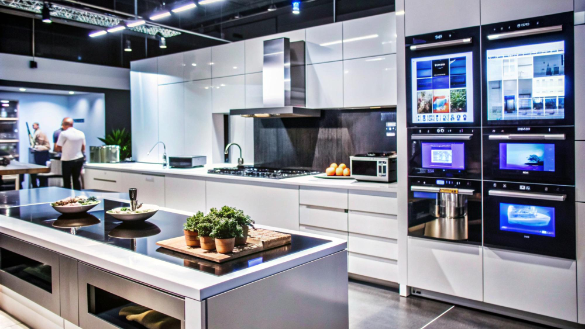

En **CalculaTuLuz.es** no solo puedes saber cuánto consume cada electrodoméstico con nuestra calculadora de luz, sino también aprender a reducir tu consumo con esta guía práctica sobre los aparatos que menos electricidad gastan en el día a día.

## Electrodomésticos que menos consumen

Algunos dispositivos del hogar destacan por su bajo consumo y eficiencia, permitiendo usarlos con más tranquilidad sin disparar la factura:

- **Bombillas LED**: consumen entre 4 y 5 W/h, frente a los 25 W de las bombillas tradicionales.
- **Ordenadores portátiles**: gastan hasta un 50% menos que un PC de sobremesa. Asegúrate de cargarlos solo cuando lo necesites.
- **Microondas**: calientan rápido y sin necesidad de calentar superficies como el horno o la vitro, lo que reduce su consumo notablemente.
- **Pequeños electrodomésticos**: tostadoras, batidoras, robots de cocina, aspiradoras o secadores tienen un uso puntual y bajo gasto.
- **Televisores LED/LCD/OLED**: son mucho más eficientes que los antiguos de plasma, siempre que se apaguen totalmente (sin dejarlos en stand-by).
- **Placas de inducción**: transmiten el calor directamente al recipiente y minimizan las pérdidas de energía.

## Electrodomésticos que más energía consumen

Según la OCU y el IDAE, estos son los aparatos que representan el mayor gasto eléctrico anual en una vivienda:

| Electrodoméstico     | Consumo anual aprox. | Tipo de uso     |
|------------------------|----------------------|-----------------|
| Frigorífico            | 662 kWh              | Continuo        |
| Congelador            | 563 kWh              | Continuo        |
| Televisor             | 263 kWh              | Stand-by        |
| Lavadora              | 255 kWh              | Puntual         |
| Secadora              | 255 kWh              | Puntual         |
| Lavavajillas          | 246 kWh              | Puntual         |

### Frigorífico
Es el aparato con mayor consumo por su uso constante. Representa el 14% de la factura eléctrica total. Para reducir su gasto:
- Mantén la temperatura entre 3°C y 7°C.
- Evita abrir la puerta innecesariamente.
- Desconéctalo si estarás fuera varios días.

### Congelador
Muy similar al frigorífico, pero con menos aperturas diarias. Mantén entre -18°C y -20°C y evita acumulación de escarcha.

### Televisor
Aunque su uso diario puede ser bajo, su consumo en modo espera (stand-by) puede representar el 2,2% del total anual. Apágalo completamente o usa regletas con interruptor.

### Lavadora
Uno de los que más gasta por uso. Una carga puede consumir entre 0,5 y 3,5 kWh. Para ahorrar:
- Lava en frío o en modo ECO.
- Aprovecha las horas de luz más baratas si tu tarifa es con discriminación horaria.

### Secadora
Cada uso puede consumir 2,1 kWh. Usa programas con menos temperatura o que faciliten el planchado. Sólo sécala cuando sea necesario y a carga completa.

### Lavavajillas
Supone un 3% del gasto eléctrico. Para mejorar su eficiencia:
- Llénalo completamente.
- Usa modo ECO o BIO.
- Actívalo en horas de bajo coste según tu tarifa.

## Consejos para reducir el consumo de luz en casa

Aquí tienes algunos hábitos fáciles de aplicar que marcan la diferencia:

- **Frigorífico y congelador**: mantén las temperaturas recomendadas, no dejes que se forme escarcha y abre las puertas lo mínimo.
- **Lavadora**: usa programas cortos y agua fría. Una lavadora medio vacía consume lo mismo.
- **Lavavajillas**: limpia el filtro y revisa sal y abrillantador. Aprovecha su modo ECO.
- **Secadora**: elige programas que reduzcan el planchado. Gasta menos y te ahorra tiempo.
- **Electrónica en stand-by**: desconéctalos por completo. Una regleta con interruptor puede ahorrarte hasta un 8%.

### Y por último: revisa tu tarifa

No importa cuánto ahorres si estás pagando una tarifa poco competitiva. Compara precios del kWh, potencia contratada y si se ajusta a tu horario de consumo. En **CalculaTuLuz.es** te ayudamos a entender tu consumo y a tomar mejores decisiones para tu bolsillo y el planeta 🌍.

---

¡Sigue explorando nuestra sección de [Tips & Guías](/tipsyguias) para aprender más formas de ahorrar energía en casa!

