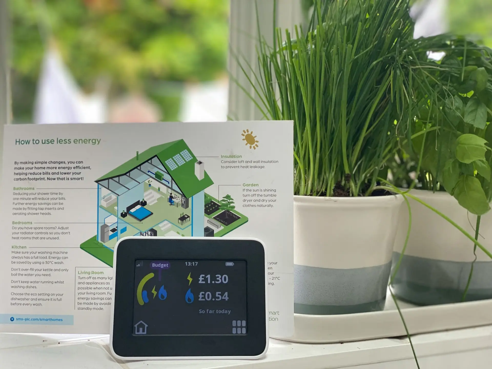

import Table from '@/components/Table'

export const columns = [
  {
    accessorKey: "electrodomestico",
    header: "Electrodoméstico",
  },
  {
    accessorKey: "potencia",
    header: "Potencia (W)",
  },
  {
    accessorKey: "uso",
    header: "Uso diario (h)",
  },
  {
    accessorKey: "consumo",
    header: "Consumo (kWh)",
  },
  {
    accessorKey: "coste",
    header: "Coste mensual (€)",
  },
];

export const data = [
  {
    electrodomestico: "Frigorífico combi A++",
    potencia: 150,
    uso: 24,
    consumo: 3.6,
    coste: 19.50,
  },
  {
    electrodomestico: "Congelador vertical",
    potencia: 200,
    uso: 24,
    consumo: 4.8,
    coste: 26.00,
  },
  {
    electrodomestico: "Lavadora (60°C)",
    potencia: 2200,
    uso: 1,
    consumo: 2.2,
    coste: 11.90,
  },
  {
    electrodomestico: "Lavavajillas (eco)",
    potencia: 1800,
    uso: 1.5,
    consumo: 2.7,
    coste: 14.60,
  },
  {
    electrodomestico: "Horno eléctrico",
    potencia: 2000,
    uso: 0.5,
    consumo: 1.0,
    coste: 5.40,
  },
  {
    electrodomestico: "Placa vitrocerámica",
    potencia: 1500,
    uso: 0.75,
    consumo: 1.1,
    coste: 6.00,
  },
  {
    electrodomestico: "Microondas",
    potencia: 1000,
    uso: 0.25,
    consumo: 0.25,
    coste: 1.35,
  },
  {
    electrodomestico: "Televisor LED 55\"",
    potencia: 120,
    uso: 4,
    consumo: 0.48,
    coste: 2.60,
  },
  {
    electrodomestico: "Ordenador sobremesa",
    potencia: 300,
    uso: 5,
    consumo: 1.5,
    coste: 8.10,
  },
  {
    electrodomestico: "Portátil",
    potencia: 90,
    uso: 5,
    consumo: 0.45,
    coste: 2.45,
  },
  {
    electrodomestico: "Router WiFi",
    potencia: 15,
    uso: 24,
    consumo: 0.36,
    coste: 1.95,
  },
  {
    electrodomestico: "Aire acondicionado",
    potencia: 2500,
    uso: 4,
    consumo: 10.0,
    coste: 54.00,
  },
  {
    electrodomestico: "Calefactor eléctrico",
    potencia: 2000,
    uso: 3,
    consumo: 6.0,
    coste: 32.40,
  },
  {
    electrodomestico: "Secadora",
    potencia: 3000,
    uso: 0.5,
    consumo: 1.5,
    coste: 8.10,
  },
  {
    electrodomestico: "Aspiradora",
    potencia: 1200,
    uso: 0.25,
    consumo: 0.3,
    coste: 1.65,
  },
  {
    electrodomestico: "Bombilla LED 10W",
    potencia: 10,
    uso: 6,
    consumo: 0.06,
    coste: 0.33,
  },
];

 

¿Alguna vez has abierto tu factura de la luz con ese sentimiento de incredulidad al ver el importe?  
¿Te has preguntado qué electrodomésticos son los responsables de ese consumo que no para de aumentar?  

En **CalculaTuLuz.es** entendemos tu frustración y por eso hemos desarrollado una **calculadora de electrodomésticos avanzada** que te permite desglosar el consumo eléctrico de tu hogar aparato por aparato.

Esta herramienta no solo te muestra cuántos kWh consume cada dispositivo, sino que te ayuda a visualizar el **coste real en euros** de mantener enchufados todos tus electrodomésticos. Con esta información, podrás **tomar el control de tu consumo, optimizar tus hábitos y reducir tu factura eléctrica** de forma significativa .

---

## ¿Qué es exactamente una calculadora de electrodomésticos?

Una **calculadora de electrodomésticos** es una herramienta digital diseñada para estimar con precisión el consumo energético de los dispositivos eléctricos de tu hogar.  
A diferencia de las estimaciones genéricas, nuestra calculadora se adapta a tu **patrón de consumo real** y a las condiciones específicas de tu contrato eléctrico.

Si quieres entender mejor [cómo calcular el consumo de cualquier electrodoméstico](https://calculatuluz.es/tipsyguias/como-calcular-consumo-electrodomestico/), tenemos una guía detallada que te explica todos los conceptos básicos.

---

## ¿Cómo funciona?

El sistema se basa en tres variables fundamentales:

1. **Potencia del electrodoméstico (vatios o kilovatios)**  
   - Encontrada en la etiqueta energética o manual del aparato.  
   - Ejemplo: [nevera](https://calculatuluz.es/calculadora-consumo-nevera/) (150W), [televisor](https://calculatuluz.es/calculadora-consumo-televisor/) (120W), [lavadora](https://calculatuluz.es/calculadora-consumo-lavadora/) (2.200W).  

2. **Tiempo de uso real (horas y minutos diarios/semanales)**  
   - Basado en tus hábitos reales de consumo.  
   - Incluye modos standby que muchos desconocen.  

3. **Precio del kWh de tu tarifa eléctrica**  
   - Variable según tu compañía y tipo de tarifa.  
   - Consulta el [precio de la luz hoy](https://calculatuluz.es/precio-luz-hoy/) en tiempo real.
   - Puede incluir discriminación horaria si aplica.  

**Resultado**: Obtienes el consumo en kWh y el coste en euros exactos que representa cada electrodoméstico en tu factura.

---

## Ejemplos prácticos: del dato abstracto al coste real

### Caso 1: La nevera – el consumidor silencioso  
- Electrodoméstico: Nevera combi A++  
- Potencia: 150W (0,15 kW)  
- Uso: 24 horas/día (funcionamiento cíclico)  
- Precio kWh: 0,18 €  

**Cálculo**:  
- Consumo diario: `0,15 kW × 24 h = 3,6 kWh`  
- Coste diario: `3,6 × 0,18 = 0,65 €`  
- Gasto mensual: 19,50 €  
- Gasto anual: 234 €  

 Aunque es eficiente, su funcionamiento continuo lo convierte en uno de los mayores consumidores. Usa nuestra [calculadora específica de nevera](https://calculatuluz.es/calculadora-consumo-nevera/) para más detalles.

---

### Caso 2: El aire acondicionado – el gigante energético  
- Electrodoméstico: Aire acondicionado split 12.000 BTU  
- Potencia: 2.500W (2,5 kW) en refrigeración  
- Uso: 6 h/día en verano (90 días/año)  
- Precio kWh: 0,18 €  

**Cálculo**:  
- Consumo diario: `2,5 × 6 = 15 kWh`  
- Coste diario: `15 × 0,18 = 2,70 €`  
- Gasto estacional: 243 €  

¿Quieres saber más sobre el consumo de tu climatizador? Consulta nuestra [calculadora de aire acondicionado](https://calculatuluz.es/calculadora-consumo-aire-acondicionado/) con ejemplos de 8 horas de uso.

---

### Caso 3: Los vampiros energéticos – el consumo fantasma  
¿Sabías que muchos dispositivos consumen energía incluso apagados?  

- [Televisores](https://calculatuluz.es/calculadora-consumo-televisor/): 0,5–3W continuos  
- Cargadores: 0,2–1W aunque no carguen  
- Decodificadores TDT: 5–15W 24h  

Ejemplo acumulado:  
- 10 dispositivos en standby con consumo de 5W  
- Consumo diario: `0,005 × 24 × 10 = 1,2 kWh`  
- Coste diario: `1,2 × 0,18 = 0,22 €`  
- Gasto anual: **80 €**  

Descubre más sobre [cómo ahorrar electricidad](https://calculatuluz.es/tipsyguias/ahorra-electricidad/) eliminando estos vampiros energéticos.

---

## Tabla de consumo extendida de electrodomésticos

<Table columns={columns} data={data} />

*Cálculo con 0,18 €/kWh y 30 días de uso mensual*

---

## ¿Por qué deberías usar nuestra calculadora?

1. **Ahorro económico tangible**: detecta qué aparatos disparan tu factura.  
2. **Optimización de tarifas**: descubre si te conviene una con discriminación horaria según tus [consejos para ahorrar según tu tarifa](https://calculatuluz.es/tipsyguias/consejos-para-ahorrar-en-la-factura-de-la-luz-segun-tu-tarifa-guia-completa-2026/).  
3. **Decisiones de compra informadas**: compara impacto entre modelos.  
4. **Concienciación familiar**: comparte resultados para hábitos responsables.  
5. **Reducción de huella de carbono**: cada kWh ahorrado = 0,3 kg CO₂ menos.  

---

## Calculadoras específicas por electrodoméstico

Para un análisis más detallado de cada aparato, tenemos calculadoras especializadas:

### **Electrodomésticos de cocina**
- [**Horno eléctrico**](https://calculatuluz.es/calculadora-consumo-horno/): Calcula el consumo según temperatura y tiempo de uso
- [**Microondas**](https://calculatuluz.es/calculadora-consumo-microondas/): Descubre cuánto gastas calentando comida
- [**Vitrocerámica**](https://calculatuluz.es/calculadora-consumo-vitroceramica/): Optimiza el uso de tus placas de cocción
- [**Freidora de aire**](https://calculatuluz.es/calculadora-consumo-freidora-aire/): Compárala con el horno tradicional

### **Limpieza y lavado**
- [**Lavadora**](https://calculatuluz.es/calculadora-consumo-lavadora/): Según temperatura y programa
- [**Lavavajillas**](https://calculatuluz.es/calculadora-consumo-lavavajillas/): Programa eco vs intensivo
- [**Secadora**](https://calculatuluz.es/calculadora-consumo-secadora/): El gran consumidor del hogar

### **Climatización**
- [**Aire acondicionado**](https://calculatuluz.es/calculadora-consumo-aire-acondicionado/): Con ejemplos de 8 horas diarias
- [**Radiador eléctrico**](https://calculatuluz.es/calculadora-consumo-radiador/): Consumo por tipo y potencia
- [**Ventilador**](https://calculatuluz.es/calculadora-consumo-ventilador/): La alternativa económica al AC

### **Iluminación y tecnología**
- [**Bombillas LED**](https://calculatuluz.es/calculadora-consumo-bombilla-led/): Ahorro vs incandescentes
- [**Televisor**](https://calculatuluz.es/calculadora-consumo-televisor/): Según tamaño y tecnología
- [**Ordenador portátil**](https://calculatuluz.es/calculadora-consumo-ordenador-portatil/): Teletrabajo eficiente
- [**PC Gaming**](https://calculatuluz.es/calculadora-consumo-pc-gaming/): Para gamers conscientes del consumo

### **Agua caliente**
- [**Termo eléctrico**](https://calculatuluz.es/calculadora-consumo-termo-electrico/): Uno de los mayores consumidores del hogar

---

## Consejos avanzados de ahorro tras usar la calculadora

### Nevera y congelador
- Mantén 4–5°C (nevera) y –18°C (congelador).  
- Limpia la parte trasera 1 vez/año.  
- No introduzcas alimentos calientes.  
- Revisa las gomas de cierre.  

Más detalles en nuestra [calculadora de nevera](https://calculatuluz.es/calculadora-consumo-nevera/).

### Lavadora y lavavajillas
- Usa programas eco y baja temperatura.  
- Lávalos llenos.  
- Limpia filtros regularmente.  
- Mantén la caldera en buen estado.  

Profundiza con nuestras calculadoras de [lavadora](https://calculatuluz.es/calculadora-consumo-lavadora/) y [lavavajillas](https://calculatuluz.es/calculadora-consumo-lavavajillas/).

### Climatización
- Usa termostatos programables.  
- Limpia filtros de AC regularmente.
- [Ventiladores de techo](https://calculatuluz.es/calculadora-consumo-ventilador/) como alternativa económica.
- Ventilación natural en horas frescas.  

### Standby y vampiros energéticos
- Regletas con interruptor.  
- Desconecta cargadores cuando no los uses.
- Configura ahorro energético en [TV](https://calculatuluz.es/calculadora-consumo-televisor/) y [PC](https://calculatuluz.es/calculadora-consumo-pc-gaming/).  

Descubre todos los trucos en nuestra guía sobre [cómo ahorrar luz](https://calculatuluz.es/tipsyguias/como-ahorrar-luz/).

---

## Cómo interpretar tus resultados

- **Identifica grandes consumidores**: nevera, climatización o antiguos aparatos.  
- **Analiza patrones**: ¿usas más en horas punta? Cambia a horas valle.  
- **Evalúa antigüedad**: >10 años = hasta 60% más consumo.  
- **Calcula ROI**: simula el ahorro de cambiar a modelos eficientes.  

Usa nuestra herramienta [Mi Consumo](https://calculatuluz.es/mi-consumo/) para ver tu perfil completo de gasto eléctrico.

---

## Accede ahora a nuestra Calculadora de Electrodomésticos

Usa nuestra **[Calculadora de Electrodomésticos](https://calculatuluz.es/)** y descubre en menos de 3 minutos:  

- El coste real de cada aparato en tu factura.  
- Cuánto ahorrarías optimizando su uso.  
- Qué dispositivos son tus **vampiros energéticos**.  
- Recomendaciones personalizadas para tu caso.  

---

## ¿Quieres profundizar más?

- [Guía definitiva de ahorro energético en el hogar](https://calculatuluz.es/tipsyguias/)  
- [Calculadora de consumo de calefactores eléctricos](https://calculatuluz.es/tipsyguias/calcular-el-consumo-de-energia-de-los-calefactores-electricos/)
- [Cómo se calcula el precio de la luz y quién lo fija](https://calculatuluz.es/tipsyguias/como-se-calcula-el-precio-de-la-luz-y-quien-lo-fija/)
- [Precio de la luz hoy en tiempo real](https://calculatuluz.es/precio-luz-hoy/)  

---

## Preguntas frecuentes

**¿Son precisos los cálculos de la calculadora?**  
Sí. Utiliza algoritmos basados en estándares europeos con un margen de error < 5% frente a enchufes inteligentes. Para electrodomésticos específicos, nuestras calculadoras especializadas ofrecen aún más precisión.

**¿Cómo encuentro la potencia de mis electrodomésticos?**  
En la etiqueta trasera, manual del aparato o buscando el modelo en nuestra base de datos. También puedes consultar nuestra guía sobre [cómo calcular el consumo de electrodomésticos](https://calculatuluz.es/tipsyguias/como-calcular-consumo-electrodomestico/).

**¿Incluye la calculadora el consumo en modo standby?**  
Sí, contempla dispositivos que funcionan en este modo ([TV](https://calculatuluz.es/calculadora-consumo-televisor/), equipos de audio, etc.). Los vampiros energéticos pueden representar hasta el 10% de tu factura.

**¿Qué electrodoméstico consume más electricidad?**  
Depende del uso, pero típicamente son: [aire acondicionado](https://calculatuluz.es/calculadora-consumo-aire-acondicionado/), [termo eléctrico](https://calculatuluz.es/calculadora-consumo-termo-electrico/), [calefacción](https://calculatuluz.es/calculadora-consumo-radiador/), y [secadora](https://calculatuluz.es/calculadora-consumo-secadora/). La [nevera](https://calculatuluz.es/calculadora-consumo-nevera/), aunque eficiente, consume mucho por estar siempre encendida.

**¿Merece la pena cambiar electrodomésticos viejos?**  
Sí. Un electrodoméstico de más de 10 años puede consumir hasta 60% más que uno nuevo clase A+++. Usa nuestras calculadoras específicas para calcular el periodo de amortización.

---

Toma el control de tu energía hoy mismo.  
Con nuestra **calculadora de electrodomésticos** pasarás de la sorpresa al recibir la factura a la satisfacción de saber cómo optimizar tu consumo y ahorrar cada mes.  

¡No esperes más! Descubre ahora tu consumo real y comienza a ahorrar de forma inteligente.