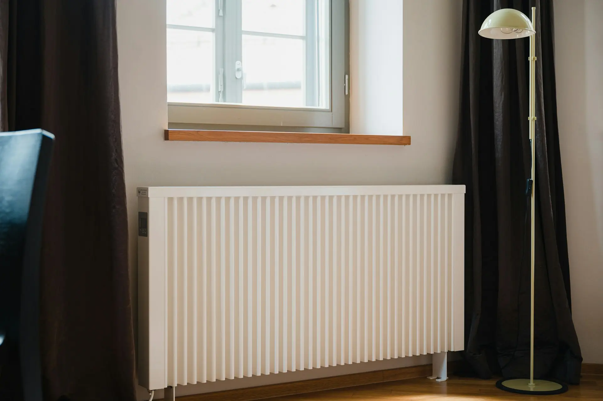

import Table from '@/components/Table'

export const columns = [
  {
    accessorKey: "tipo",
    header: "Tipo de Calefactor",
  },
  {
    accessorKey: "potencia",
    header: "Potencia (W)",
  },
  {
    accessorKey: "uso",
    header: "Uso diario (h)",
  },
  {
    accessorKey: "consumo",
    header: "Consumo real (kWh/día)",
  },
  {
    accessorKey: "coste",
    header: "Coste mensual (€)",
  },
];

export const data = [
  {
    tipo: "Radiador aceite 7 elem.",
    potencia: 1500,
    uso: 8,
    consumo: 6.0,
    coste: 68.40,
  },
  {
    tipo: "Emisor térmico seco",
    potencia: 1000,
    uso: 10,
    consumo: 5.0,
    coste: 57.00,
  },
  {
    tipo: "Convector con ventilador",
    potencia: 2000,
    uso: 6,
    consumo: 7.2,
    coste: 82.08,
  },
  {
    tipo: "Panel radiante",
    potencia: 800,
    uso: 5,
    consumo: 2.4,
    coste: 27.36,
  },
  {
    tipo: "Termoventilador",
    potencia: 1800,
    uso: 4,
    consumo: 4.3,
    coste: 49.02,
  },
  {
    tipo: "Calefactor cerámico",
    potencia: 1200,
    uso: 7,
    consumo: 5.0,
    coste: 57.00,
  },
  {
    tipo: "Radiador inercia fluida",
    potencia: 1500,
    uso: 9,
    consumo: 8.1,
    coste: 92.34,
  },
];

¿Llega el invierno y te aterra pensar en la factura de la luz?  
¿Te preguntas cuánto realmente consumen esos calefactores que tanto confort te proporcionan?

En **CalculaTuLuz.es** sabemos que la calefacción eléctrica puede suponer hasta el 50% de tu consumo invernal. Por eso hemos creado esta [**Calculadora de consumo eléctrico de electrodomésticos**](https://calculatuluz.es/) que te permite conocer el consumo exacto de cada aparato.

Con esta herramienta podrás **anticipar tu gasto, optimizar el uso y reducir significativamente tu factura** este invierno 🌡️.

## ¿Qué es exactamente el kWh en calefacción eléctrica?

- **k** = kilo = 1000
- **W** = Vatio = Unidad de potencia del calefactor
- **h** = Hora = Tiempo de funcionamiento

Un **kilovatio-hora (kWh)** es el consumo que genera un calefactor de 1000 vatios (1 kW) funcionando durante una hora completa.

**Ejemplo práctico:**  
Si tienes un calefactor de 2000 W (2 kW) encendido durante 5 horas:  
`2 kW × 5 h = 10 kWh consumidos`

## ¿Cómo funciona nuestra calculadora de calefacción?

El cálculo se basa en tres variables clave:

1. **Potencia del calefactor (vatios)**
   - Encontrada en la etiqueta del aparato
   - Ejemplos: emisor térmico (1500W), convector (2000W), radiador (1000W)

2. **Tiempo de uso real (horas/día)**
   - Considera que los calefactores con termostato no consumen continuamente
   - Varía según temperatura exterior y aislamiento de tu vivienda

3. **Precio actual del kWh**
   - Precio medio: **0,35-0,40 €/kWh**
   - Varía según tu tarifa y compañía eléctrica

## Ejemplos prácticos: del consumo al coste real

### Caso 1: Emisor térmico en dormitorio  
- Calefactor: Emisor térmico de 1500W  
- Potencia: 1500W (1,5 kW)  
- Uso: 8 horas/día (con termostato, consumo real ≈ 50%)  
- Precio kWh: 0,38 €  

**Cálculo realista:**  
- Consumo efectivo: `1,5 kW × 8 h × 0,5 = 6 kWh/día`  
- Coste diario: `6 × 0,38 = 2,28 €`  
- Gasto mensual: **68,40 €**  

### Caso 2: Convector en salón – el gran consumidor  
- Calefactor: Convector de 2000W  
- Potencia: 2000W (2 kW)  
- Uso: 12 horas/día (consumo real ≈ 60%)  
- Precio kWh: 0,38 €  

**Cálculo:**  
- Consumo diario: `2 kW × 12 h × 0,6 = 14,4 kWh`  
- Coste diario: `14,4 × 0,38 = 5,47 €`  
- Gasto mensual: **164,10 €**  

### Caso 3: Múltiples aparatos – el escenario real  
¿Tienes varios calefactores funcionando simultáneamente?

- Dormitorio 1: 1000W × 8h × 0,5 = 4 kWh/día  
- Dormitorio 2: 1200W × 6h × 0,5 = 3,6 kWh/día  
- Salón: 2000W × 5h × 0,6 = 6 kWh/día  

**Total diario:** 13,6 kWh  
**Coste mensual:** `13,6 × 0,38 × 30 = 155,04 €`

## Tabla de consumo de calefactores eléctricos

<Table columns={columns} data={data} />

## La trampa de la potencia contratada en invierno

Este coste fijo puede dispararse si necesitas aumentar tu potencia por usar múltiples calefactores.

**Ejemplo en 2025:**  
Coste potencia: ~50 €/kW al año = **4,17 €/mes por kW**

- Potencia contratada 4,6 kW: `4,6 × 4,17 = 19,18 €/mes`  
- Si aumentas a 5,75 kW: `5,75 × 4,17 = 23,98 €/mes`  
- **Diferencia:** +4,80 €/mes (57,60 €/año) solo por tenerla disponible

## Consejos avanzados para ahorrar en calefacción

### Optimiza el uso con termostatos
- Configura **20-21°C** para día y **18°C** para noche
- Los termostatos programables pueden ahorrarte hasta 30%
- Apaga en habitaciones no ocupadas

### Elección inteligente de aparatos
- **Uso continuado:** Emisores térmicos o radiadores de aceite
- **Calor rápido:** Convectores con ventilador para estancias de uso puntual
- **Distribución óptima:** Mejor varios aparatos pequeños que uno grande en espacios amplios

### Calcula tu necesidad real de potencia
- **80-100 W por m²** de superficie
- Habitación 12 m²: `12 × 100 = 1200 W`
- Salón 25 m²: `25 × 100 = 2500 W` (mejor dos de 1200W)

## Métodos para medir tu consumo real

## Método 1: Cálculo con contador inteligente
1. Anota lectura del contador por la mañana
2. Usa la calefacción con normalidad 24h
3. Anota nueva lectura al día siguiente
4. **Diferencia = consumo real de calefacción**

### Método 2: Comparativa con/sin calefacción
- Mide consumo base un día sin calefacción
- Mide consumo otro día con calefacción
- **Diferencia = coste atribuible a calefacción**

### Accede a nuestra calculadora de consumo eléctrico 

Usa nuestra **[Calculadora de Consumo Eléctrico](https://calculatuluz.es/)** y descubre en segundos:

- El coste exacto de cada calefactor en tu factura
- Cuánto ahorrarías optimizando temperaturas y horarios
- La potencia ideal para cada estancia de tu hogar
- Recomendaciones personalizadas para tu caso

## Preguntas frecuentes

**¿Todos los calefactores consumen igual por la misma potencia?**  
Sí, pero la diferencia está en cómo distribuyen el calor y el confort que proporcionan.

**¿Es mejor dejar el calefactor encendido todo el día o encender/apagar?**  
Con termostatos modernos, es más eficiente mantener una temperatura constante que apagar y encender repetidamente.

**¿Cómo afecta el aislamiento de mi casa al consumo?**  
Una casa mal aislada puede aumentar tu consumo de calefacción hasta un 40%.

**¿Debo preocuparme por la potencia contratada al usar calefacción?**  
Sí, calcula la suma de potencias de aparatos que usas simultáneamente para evitar que salte el ICP.

Toma el control de tu calefacción este invierno.  
Con nuestra **calculadora especializada** pasarás del susto en la factura al ahorro inteligente.

¡No esperes a la próxima factura! Descubre ahora tu consumo real y comienza a ahorrar desde hoy mismo.