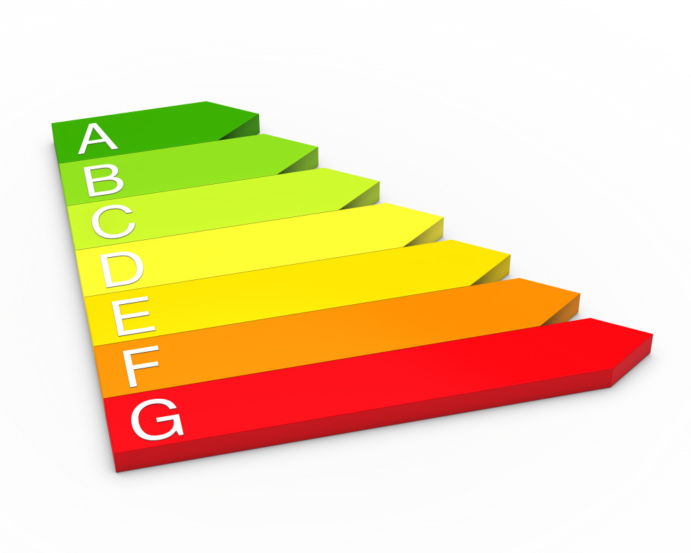
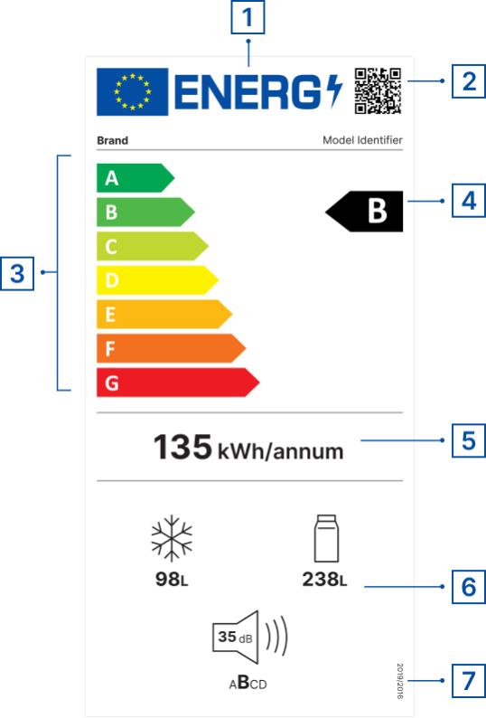

En **CalculaTuLuz.es** sabemos que elegir un electrodoméstico eficiente puede suponer un gran ahorro en tu factura de luz. Con esta guía aprenderás **cómo leer la etiqueta energética** de tus aparatos y sacarles el máximo partido.

## ¿Qué es la etiqueta energética?

La etiqueta energética es un distintivo obligatorio en la UE que informa sobre el **consumo anual**, la clase de eficiencia y características clave del electrodoméstico. Te ayuda a:

- Comparar rápidamente modelos.
- Conocer el gasto eléctrico aproximado (kWh/año).
- Tomar decisiones de compra sostenibles y rentables.

## Cómo interpretar las clases de eficiencia

Las clases van desde la **A+++** (máxima eficiencia) hasta la **D/G** (menos eficientes), según el tipo de producto:

| Clase       | Color           | Significado                                 |
|-------------|-----------------|---------------------------------------------|
| A+++        | Verde           | Consumo muy bajo: máxima eficiencia.        |
| A++         | Verde claro     | Consumo bajo: ahorro notable.               |
| A+          | Amarillo claro  | Buen nivel de eficiencia.                   |
| A           | Amarillo        | Eficiencia estándar.                        |
| B–D / E–G   | Naranja/Rojo    | Consumo elevado: menos recomendable.         |

> ⚠️ **Nota:** Desde marzo de 2021 la escala se revisa para volver a clases A–G, eliminando los “+”. Consulta siempre la etiqueta más reciente.

## Detalles clave de la etiqueta

Además de la **clase de eficiencia**, revisa estos puntos esenciales:

1. **Consumo anual en kWh**  
   Valor que indica el gasto energético aproximado al año.
2. **Nivel de ruido (dB)**  
   Importante en lavadoras, lavavajillas y campanas extractoras.
3. **Capacidad útil**  
   Litros en frigoríficos, kilos en lavadoras; elige según tus necesidades.
4. **Funciones destacadas**  
   Modo ECO, descongelación rápida, sensor de carga, etc., que pueden abaratar el consumo.
5. **Documentación adicional**  
   El código QR o enlace a la Ficha Técnica Europea ofrece más detalles y comparativas.

## Comprendiendo la etiqueta energética

Identifica cada elemento de la etiqueta fácilmente:

1. **Logotipo neutral**: el “rayo” sustituye la última letra de ENERG y se adapta a idiomas de la UE (Energy, Energie, Energía, Énergie, Energija, Enerģija, Energi…).
2. **Código QR (EPREL)**: vincula con la base de datos oficial [EPREL](https://eprel.ec.europa.eu/screen/home) para consultar la ficha técnica.
3. **Clases de eficiencia**: escala de A (más eficiente) a G (menos eficiente).
4. **Clase energética del modelo**: clasificación específica de este aparato.
5. **Consumo energético**: valor anual expresado en kWh/año.
6. **Parámetros complementarios**: emisiones de ruido, consumo de agua, capacidad, reparabilidad y fiabilidad.
7. **Referencia normativa**: indica el reglamento de la UE que regula la etiqueta.

## Pasos para elegir el electrodoméstico más eficiente

1. **Compara clases y consumo**: opta por A++ o A+++ (o A–B en la nueva escala) y un kWh/año bajo.
2. **Adecúa la capacidad**: evita comprar frigoríficos o lavadoras excesivamente grandes.
3. **Prioriza modos ECO**: reducen luz y agua en cada ciclo.
4. **Ten en cuenta el nivel de ruido**: un aparato ≤40 dB mejora el confort.
5. **Consulta opiniones**: verifica el rendimiento real y la fiabilidad de otros usuarios.

## Beneficios de una correcta interpretación

- **Ahorro económico**: hasta un 30 % menos en factura.
- **Mayor durabilidad**: tecnología de última generación en aparatos eficientes.
- **Responsabilidad ambiental**: menor huella de carbono.

## Sigue aprendiendo en CalculaTuLuz.es

- 📊 Calcula el coste de tus electrodomésticos con nuestra [Calculadora de Consumo](/).
- 📝 Descubre más consejos en [Tips & Guías](/tipsyguias) para optimizar tu hogar.

Con esta guía para **leer la etiqueta energética**, tomarás decisiones inteligentes y contribuirás al ahorro energético de tu casa. ¡Empieza hoy a reducir tu factura y cuidar el planeta! 🌍

