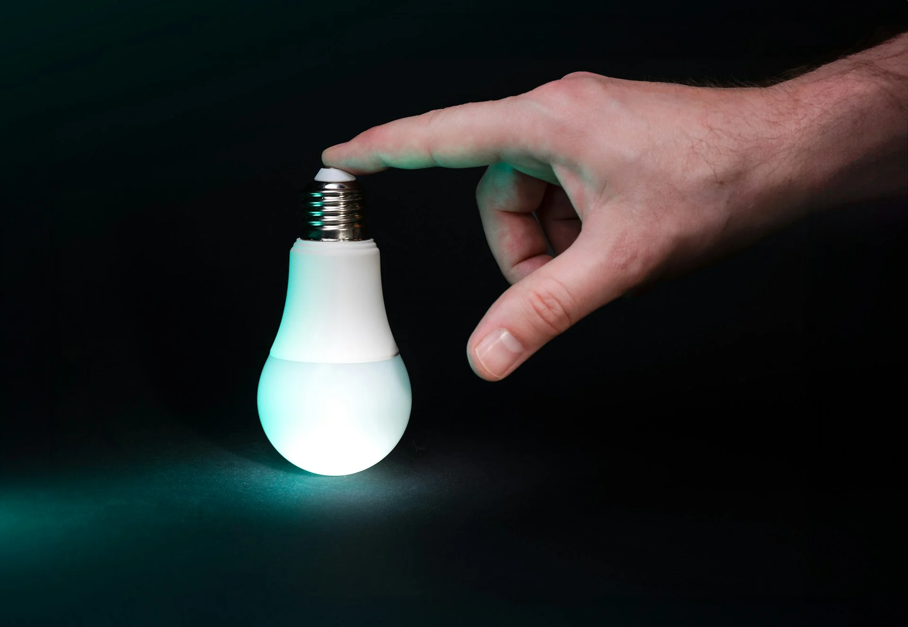

import Table from '@/components/Table'

export const columnsConsumo = [
  {
    accessorKey: "ranking",
    header: "Ranking",
  },
  {
    accessorKey: "electrodomestico",
    header: "Electrodoméstico",
  },
  {
    accessorKey: "potencia",
    header: "Potencia (W)",
  },
  {
    accessorKey: "usodiario",
    header: "Uso diario (h)",
  },
  {
    accessorKey: "consumoMensual",
    header: "Consumo mensual (kWh)",
  },
  {
    accessorKey: "costeMensual",
    header: "Coste mensual (€)",
  },
];

export const dataConsumo = [
  {
    ranking: "1",
    electrodomestico: "Calefacción eléctrica",
    potencia: "1000-3000",
    usodiario: "8-12",
    consumoMensual: "240-1080",
    costeMensual: "84-378",
  },
  {
    ranking: "2",
    electrodomestico: "Aire acondicionado",
    potencia: "1000-2500",
    usodiario: "6-10",
    consumoMensual: "180-750",
    costeMensual: "63-262",
  },
  {
    ranking: "3",
    electrodomestico: "Termo eléctrico",
    potencia: "1500-2000",
    usodiario: "2-4",
    consumoMensual: "90-240",
    costeMensual: "31-84",
  },
  {
    ranking: "4",
    electrodomestico: "Secadora",
    potencia: "2000-3000",
    usodiario: "1-2",
    consumoMensual: "60-180",
    costeMensual: "21-63",
  },
  {
    ranking: "5",
    electrodomestico: "Horno eléctrico",
    potencia: "2000-2500",
    usodiario: "1-2",
    consumoMensual: "60-150",
    costeMensual: "21-52",
  },
  {
    ranking: "6",
    electrodomestico: "Vitrocerámica/inducción",
    potencia: "1500-2000",
    usodiario: "1-3",
    consumoMensual: "45-180",
    costeMensual: "16-63",
  },
  {
    ranking: "7",
    electrodomestico: "Lavavajillas",
    potencia: "1500-2000",
    usodiario: "1",
    consumoMensual: "45-60",
    costeMensual: "16-21",
  },
  {
    ranking: "8",
    electrodomestico: "Lavadora",
    potencia: "1500-2000",
    usodiario: "1",
    consumoMensual: "45-60",
    costeMensual: "16-21",
  },
  {
    ranking: "9",
    electrodomestico: "Frigorífico",
    potencia: "100-200",
    usodiario: "24",
    consumoMensual: "30-60",
    costeMensual: "10-21",
  },
  {
    ranking: "10",
    electrodomestico: "Televisor",
    potencia: "100-300",
    usodiario: "4-6",
    consumoMensual: "12-54",
    costeMensual: "4-19",
  },
];

¿Te has preguntado alguna vez cuánto te cuesta realmente dejar el cargador enchufado? ¿O por qué tu factura de la luz sube mes tras mes sin que hayas cambiado tus hábitos? La respuesta está en conocer **el consumo real de cada electrodoméstico** de tu hogar.

En esta guía completa aprenderás todo lo necesario para calcular, entender y optimizar el consumo eléctrico de cualquier aparato. Y lo mejor: descubrirás cómo ahorrar hasta un **40% en tu factura** tomando decisiones informadas.

## ¿Por qué es importante calcular el consumo de tus electrodomésticos?

Conocer el consumo eléctrico de cada aparato te permite:

- **Identificar los "vampiros energéticos"** que disparan tu factura sin que lo notes
- **Tomar decisiones de compra inteligentes** al renovar electrodomésticos
- **Optimizar tu potencia contratada** y evitar pagar de más cada mes
- **Planificar tu uso energético** para aprovechar las horas valle si tienes tarifa discriminación horaria
- **Reducir tu huella de carbono** mientras ahorras dinero

Según estudios recientes, el **hogar medio español podría ahorrar entre 200-400€ anuales** simplemente optimizando el uso de sus electrodomésticos actuales.

## ¿Qué es el consumo eléctrico y cómo se mide?

El consumo eléctrico es la cantidad de energía que un aparato utiliza durante su funcionamiento. Se mide en **kilovatios-hora (kWh)**, que es la unidad que verás en tu factura de la luz.

### La fórmula básica del consumo eléctrico

Todo electrodoméstico tiene dos datos fundamentales que determinan su consumo:

**Consumo (kWh) = Potencia (W) ÷ 1000 × Horas de uso**

Donde:
- **Potencia (W):** Los vatios que consume el aparato
- **Horas de uso:** El tiempo real de funcionamiento
- **kWh:** Kilovatios-hora consumidos

### Ejemplo práctico paso a paso

Imagina que tienes un horno eléctrico de 2200 W que usas 1,5 horas para preparar la comida:

1. Potencia: 2200 W = 2,2 kW
2. Tiempo: 1,5 horas
3. Consumo: 2,2 kW × 1,5 h = **3,3 kWh**

Si tu tarifa eléctrica está a 0,35 €/kWh:
- Coste: 3,3 kWh × 0,35 €/kWh = **1,16 €**

Esa comida te ha costado 1,16€ solo en electricidad. Si cocinas así todos los días, son casi **35€ al mes** solo de horno.

**¿Quieres calcularlo automáticamente?** Prueba nuestra **[Calculadora de Consumo Eléctrico](https://calculatuluz.es/)** donde introduces potencia y horas de uso y obtienes el coste al instante.

## Cómo interpretar la etiqueta energética (2025)

La etiqueta energética es tu mejor aliada para identificar electrodomésticos eficientes. Desde marzo de 2021, el sistema se simplificó eliminando las categorías A+, A++ y A+++.

### El nuevo sistema de clasificación

- **Clase A (verde oscuro):** Máxima eficiencia - consumo hasta 55% menor
- **Clase B (verde claro):** Muy eficiente - consumo 40% menor
- **Clase C (amarillo claro):** Eficiente - consumo 25% menor
- **Clase D (amarillo):** Eficiencia media - consumo estándar
- **Clase E (naranja):** Eficiencia baja - consumo 20% superior
- **Clase F (naranja oscuro):** Poco eficiente - consumo 35% superior
- **Clase G (rojo):** Ineficiente - consumo hasta 50% superior

### Información adicional en la etiqueta

Además de la letra, encontrarás:

- **Consumo anual estimado (kWh/año)** - El dato más importante para calcular tu gasto
- **Capacidad o prestaciones** - Litros en frigoríficos, kg en lavadoras, etc.
- **Nivel de ruido (dB)** - Importante para aparatos en zonas de descanso
- **Pictogramas específicos** - Según el tipo de electrodoméstico

### El impacto económico real de la etiqueta

**Ejemplo comparativo - Frigorífico:**
- Clase A (150 kWh/año): 150 × 0,35 = **52,50€/año**
- Clase G (300 kWh/año): 300 × 0,35 = **105€/año**
- **Ahorro:** 52,50€ anuales → 262,50€ en 5 años

Invertir 100€ más en un aparato clase A se amortiza en menos de 2 años.

## ⚡ Cómo saber la potencia de cualquier electrodoméstico

La potencia es el primer dato que necesitas para calcular el consumo. Aquí te explicamos dónde encontrarla:

### 1. En la etiqueta del aparato

Busca una pegatina o placa metálica que suele estar:
- **En la parte trasera** (frigoríficos, lavadoras)
- **En la base** (microondas, tostadores)
- **En el lateral** (hornos, lavavajillas)

Encontrarás algo como:
- "Potencia: 1500W" o "Power: 1500W"
- "1500W / 230V / 50Hz"

### 2. En el manual del fabricante

Si no encuentras la etiqueta física:
- Busca el modelo exacto en Google + "especificaciones"
- Visita la web del fabricante y busca tu modelo
- El manual suele tener una tabla con todas las características técnicas

### 3. Con un medidor de consumo

Para mediciones precisas del consumo real:
- **Enchufes medidores:** 15-30€ en tiendas especializadas
- Se conectan entre el enchufe y el aparato
- Muestran consumo en tiempo real, acumulado, coste, etc.
- Ideales para identificar consumos ocultos en stand-by

### 4. A través de tu contador inteligente

Los contadores digitales modernos te permiten:
- Ver tu consumo en tiempo real desde la app de tu distribuidora
- Hacer pruebas de consumo activando/desactivando aparatos
- Detectar consumos anómalos o aparatos que fallan

## Ranking: electrodomésticos que más consumen en 2025

El consumo depende de dos factores clave: **potencia** y **duración de uso**. Aquí están los mayores consumidores del hogar español medio ordenados por impacto en tu factura:

### Top 10 de consumidores eléctricos

<Table columns={columnsConsumo} data={dataConsumo} />

**Nota importante:** Los costes están calculados con un precio medio de 0,35 €/kWh. Tu coste real puede variar según tu tarifa eléctrica.

**Destaca especialmente:**
- La **calefacción eléctrica** puede representar hasta el 50% de tu factura en invierno
- Los aparatos de **cocina** (horno + vitro) sumados pueden superar los 100€/mes en familias numerosas
- El **frigorífico**, aunque consume poco por hora, acumula mucho por funcionar 24/7

### El efecto acumulativo del consumo

Un hogar promedio español (3 personas) sin calefacción ni aire acondicionado suele tener un gasto base de **100-150€/mes**. Si añades climatización en invierno o verano, fácilmente alcanzas **200-350€ mensuales**.

La clave está en identificar tus 3-5 mayores consumidores y optimizar su uso, ahí es donde conseguirás el mayor ahorro con el menor esfuerzo.

## Guía paso a paso: calcula el consumo de cualquier aparato

Vamos a desglosar el proceso completo con ejemplos reales de tres electrodomésticos diferentes.

### Caso 1: Lavadora (consumo con ciclos variables)

**Datos del aparato:**
- Potencia: 2000 W
- Uso: 4 ciclos por semana
- Duración por ciclo: 2 horas
- Tarifa: 0,35 €/kWh

**Cálculo mensual:**
1. Convertir potencia: 2000 W = 2 kW
2. Horas mensuales: 4 ciclos/semana × 4 semanas × 2h = 32 horas/mes
3. Consumo: 2 kW × 32 h = **64 kWh/mes**
4. Coste: 64 × 0,35 = **22,40 €/mes**

**Resultado:** Tu lavadora te cuesta 22,40€ al mes (268,80€ al año).

### Caso 2: Frigorífico (consumo continuo 24/7)

**Datos del aparato:**
- Potencia: 150 W
- Uso: 24 horas/día, 365 días/año
- Factor de uso real: 40% (el compresor no está siempre activo)
- Tarifa: 0,35 €/kWh

**Cálculo mensual:**
1. Convertir potencia: 150 W = 0,15 kW
2. Horas mensuales reales: 24h × 30 días × 0,4 = 288 horas efectivas
3. Consumo: 0,15 kW × 720h × 0,4 = **43,2 kWh/mes**
4. Coste: 43,2 × 0,35 = **15,12 €/mes**

**Resultado:** Tu frigorífico te cuesta 15,12€ al mes (181,44€ al año).

### Caso 3: Calefactor portátil (uso estacional)

**Datos del aparato:**
- Potencia: 2000 W
- Uso en invierno: 5 horas/día
- Uso en invierno: 4 meses (120 días)
- Eficiencia con termostato: 60% del tiempo activo
- Tarifa: 0,35 €/kWh

**Cálculo temporada invernal:**
1. Convertir potencia: 2000 W = 2 kW
2. Horas totales: 120 días × 5h × 0,6 = 360 horas efectivas
3. Consumo: 2 kW × 360 h = **720 kWh/temporada**
4. Coste: 720 × 0,35 = **252 €/temporada**

**Resultado:** Este calefactor te cuesta 252€ durante los 4 meses de invierno (63€/mes).

### Calculadora automática

¿No quieres hacer cálculos? Usa nuestra **[Calculadora de Consumo Eléctrico](https://calculatuluz.es/)** y obtén los resultados en segundos introduciendo simplemente la potencia y las horas de uso.

## 6 señales de que un electrodoméstico está consumiendo de más

Incluso un aparato eficiente puede volverse un derrochador si no funciona correctamente. Estas son las señales de alerta:

### 1. Consumo superior al indicado en la etiqueta

Si tu frigorífico clase A consume 200 kWh/año según la etiqueta, pero calculas que está consumiendo 280 kWh, algo va mal.

**Cómo detectarlo:**
- Anota la lectura del contador al inicio del mes
- Vuelve a mirarla al final del mes
- Compara con el consumo teórico de tus aparatos

### 2. El aparato hace ruidos extraños

- **Motor que trabaja en exceso:** El compresor del frigorífico no para
- **Vibraciones anormales:** La lavadora se mueve más de lo normal
- **Zumbidos o chasquidos:** Puede indicar un componente deteriorado

Estos ruidos suelen venir acompañados de un **sobreesfuerzo energético del 15-25%**.

### 3. Filtros y componentes sucios

El mantenimiento es crucial:
- **Filtros de lavadora/lavavajillas obstruidos:** +10% consumo
- **Serpentines del frigorífico con polvo:** +15% consumo
- **Campana extractora con grasa acumulada:** +20% consumo

**Solución:** Limpieza profunda cada 3-6 meses.

### 4. Antigüedad del aparato

Los electrodomésticos pierden eficiencia con los años:
- **5-7 años:** Pérdida del 5-10%
- **8-12 años:** Pérdida del 15-25%
- **Más de 12 años:** Pérdida del 30-50%

Un frigorífico de 15 años puede consumir el **doble** que uno nuevo de clase A.

### 5. Uso inadecuado

Consumos elevados por malos hábitos:
- Lavar con media carga
- Temperaturas más altas de lo necesario
- Abrir constantemente la puerta del frigorífico
- No usar programas ECO

### 6. Averías silenciosas

Algunos problemas no son evidentes:
- Termostato descalibrado
- Juntas de puertas deterioradas (frigorífico)
- Resistencias con calcificación (termo, lavadora)
- Compresor desgastado

**Recomendación:** Si sospechas que un aparato consume mucho más de lo normal, considera una revisión técnica o su sustitución si tiene más de 10 años.

## 10 estrategias probadas para reducir el consumo

### Estrategias de uso inteligente

**1. Aprovecha las horas valle (tarifa 2.0 TD)**
Si tienes discriminación horaria:
- Programa lavadora, lavavajillas y secadora entre 00:00-08:00
- Ahorro: hasta 50% en el coste de estos aparatos

**2. Usa programas ECO siempre que sea posible**
- Lavan igual de bien pero a menor temperatura
- Reducción de consumo: 30-40%

**3. Carga completa en lavadora y lavavajillas**
- Media carga = 70% del consumo de carga completa
- Optimizando cargas: ahorro de 15-20€/mes

**4. Desconecta aparatos en stand-by**
- TV, ordenadores, consolas, microondas con reloj
- Consumo stand-by promedio: 10-15W por aparato
- **5 aparatos en stand-by = 33€/año desperdiciados**

**5. Optimiza la temperatura del frigorífico**
- Frigorífico: 4-5°C (no menos de 3°C)
- Congelador: -18°C (no menos de -20°C)
- Cada grado extra = +5% consumo

### Estrategias de mantenimiento

**6. Limpieza regular de filtros y serpentines**
- Lavadora: filtro cada mes
- Lavavajillas: filtro cada 15 días
- Frigorífico: serpentines cada 6 meses
- Secadora: filtro después de cada uso

**7. Descalcificación periódica**
Para aparatos que usan agua caliente:
- Lavadora y lavavajillas: cada 3-6 meses
- Plancha: cada 2 meses
- Cafetera: cada mes

**8. Revisar juntas y gomas**
Especialmente en frigoríficos y hornos:
- Prueba: cierra una hoja de papel en la puerta
- Si sale fácilmente, la junta está gastada
- Coste de juntas nuevas: 15-30€
- Ahorro potencial: 20% del consumo

### Estrategias de renovación

**9. Prioriza la sustitución de aparatos antiguos**
Orden de prioridad según impacto:
1. Frigoríficos > 12 años
2. Calefacción eléctrica ineficiente
3. Termo eléctrico tradicional
4. Lavadoras y secadoras > 10 años

**10. Calcula el ROI antes de renovar**
- Consumo actual vs. consumo nuevo aparato clase A
- Diferencia mensual × 12 = ahorro anual
- Coste aparato ÷ ahorro anual = años de amortización

**Ejemplo:**
- Frigorífico viejo: 300 kWh/año (105€)
- Frigorífico clase A: 150 kWh/año (52€)
- Ahorro: 53€/año
- Coste nuevo: 400€
- Amortización: 7,5 años ✓ Merece la pena

## 🔌 El problema oculto: la potencia contratada

Muchos hogares pagan de más en el **término fijo de potencia** sin saberlo. Este coste aparece en tu factura aunque no uses nada de electricidad.

### ¿Qué es la potencia contratada?

Es la potencia máxima que puedes usar simultáneamente en tu hogar. Se mide en kW y tiene un coste fijo mensual independiente de tu consumo.

**Tarifas 2.0 TD (más común en hogares):**
- **Periodo punta (P1):** ~60€/kW/año
- **Periodo valle (P2):** ~15€/kW/año

### Ejemplo de sobrepago

**Situación típica:**
- Potencia contratada: 5,75 kW
- Potencia real que necesitas: 4,6 kW
- Diferencia: 1,15 kW de sobra

**Coste anual del exceso:**
- P1: 1,15 × 60 = 69€/año
- P2: 1,15 × 15 = 17€/año
- **Total desperdiciado: 86€/año**

### Cómo calcular tu potencia real necesaria

Suma las potencias de los aparatos que usas **simultáneamente**:

**Ejemplo pico de consumo (cocinando con horno):**
- Frigorífico: 150W
- Iluminación: 200W
- Horno: 2200W
- Vitrocerámica: 1800W
- Extractor: 150W
- **Total: 4500W = 4,5 kW**

Con 4,6 kW contratados tendrías suficiente. Si tienes 5,75 kW, estás pagando de más.

**Usa nuestra [calculadora](https://calculatuluz.es/) para analizar tu consumo y optimizar tu potencia contratada.**

## Herramientas para medir tu consumo real

### Opción 1: Medidores enchufables (15-30€)

**Ventajas:**
- Medición precisa aparato por aparato
- Datos en tiempo real
- Muestran potencia instantánea, consumo acumulado y coste
- No requieren instalación

**Mejores modelos 2025:**
- Sonoff S31: Con WiFi y app móvil
- Aigostar: Básico pero preciso y económico
- Brennenstuhl PM231E: Profesional, muy preciso

### Opción 2: Contador inteligente (gratis)

Todos los hogares españoles ya tienen contador digital. Aprovéchalo:

**Cómo acceder a tus datos:**
1. Identifica tu distribuidora (Iberdrola, UFD, e-distribución...)
2. Regístrate en su web/app
3. Activa acceso a datos en tiempo real
4. Consulta consumo horario

**Ventajas:**
- Gratis
- Datos completos de toda la vivienda
- Históricos y comparativas
- Detección de picos de consumo

### Opción 3: Sistemas domóticos (100-300€)

Para control total:
- Shelly EM: Mide consumo de toda la casa
- Sense Energy Monitor: Con IA para identificar aparatos
- Emporia Vue: Hasta 16 circuitos monitorizados

## Preguntas frecuentes sobre consumo eléctrico

**¿Gastan lo mismo dos aparatos con la misma potencia?**

Sí, en términos de consumo por hora de uso. Un radiador de 1500W y un secador de 1500W consumen exactamente igual: 1,5 kWh por hora de funcionamiento. La diferencia está en cuántas horas usas cada uno.

**¿Es mejor apagar completamente o dejar en stand-by?**

Siempre es mejor apagar completamente. El stand-by puede consumir 1-10W por aparato. Con 5 aparatos en stand-by consumiendo 5W cada uno:
- 5 × 5W = 25W constantes
- 25W × 24h × 365 días = 219 kWh/año
- 219 × 0,35€ = **76,65€ al año desperdiciados**

**¿Los electrodomésticos antiguos siempre gastan más?**

No siempre, pero sí en la mayoría de casos. Un aparato bien mantenido de hace 8 años puede consumir similar a uno nuevo de gama baja. Pero comparado con uno nuevo de clase A, el antiguo consumirá un 25-40% más.

**¿Cómo sé si mi factura es normal para mi consumo?**

Formula simple:
- Divide el total de tu factura entre los kWh consumidos
- Deberías obtener 0,35-0,45 €/kWh (sumando término energía + potencia)
- Si es mayor, puede que tengas potencia sobredimensionada o tarifa inadecuada

**¿Vale la pena comprar aparatos clase A si son más caros?**

Depende del uso. Regla general:
- **Sí merece la pena:** Aparatos de uso continuo (frigoríficos, congeladores)
- **Sí merece la pena:** Aparatos de uso frecuente (lavadoras, lavavajillas)
- **Depende:** Aparatos de uso ocasional (batidoras, robots de cocina)

Calcula: (Coste extra) ÷ (Ahorro anual) = Años de amortización. Si es menos de 5-7 años, compensa.

**¿Debo cambiar todos mis electrodomésticos a la vez?**

No es necesario. Prioriza así:
1. Los que más consumen (calefacción, agua caliente)
2. Los más antiguos (>12 años)
3. Los que más usas
4. Los que fallan o requieren reparaciones caras

## Tu plan de acción inmediato

Ahora que conoces todos los secretos del consumo eléctrico, te propongo un plan de 4 pasos para empezar a ahorrar hoy mismo:

### Paso 1: Haz un inventario (30 minutos)

Recorre tu casa y anota:
- Cada electrodoméstico que tengas
- Su potencia (W) mirando la etiqueta
- Cuántas horas al día lo usas aproximadamente

### Paso 2: Identifica a los grandes consumidores (10 minutos)

Usa nuestra **[Calculadora de Consumo Eléctrico](https://calculatuluz.es/)** para introducir cada aparato y ver cuánto te cuesta mensualmente.

Ordénalos de mayor a menor coste. Los 3-5 primeros son en los que debes centrar tus esfuerzos.

### Paso 3: Aplica mejoras rápidas (1 hora)

**Acciones sin coste:**
- Ajusta temperatura del frigorífico a 4-5°C
- Programa la lavadora para horas valle si tienes 2.0TD
- Desenchufa aparatos en stand-by que no uses
- Apaga luces al salir de habitaciones

**Acciones de bajo coste (< 50€):**
- Compra regletas con interruptor para zonas de stand-by
- Adquiere un medidor enchufable para el aparato que más sospechas
- Limpia a fondo filtros y serpentines de tus aparatos

### Paso 4: Planifica inversiones inteligentes (variable)

Basándote en tu inventario:
- Identifica el aparato que más te cuesta al mes
- Calcula cuánto ahorrarías sustituyéndolo por uno clase A
- Decide si la inversión merece la pena (amortización < 7 años)

## Conclusión: el conocimiento es ahorro

Calcular el consumo de tus electrodomésticos no es un ejercicio teórico: es la herramienta más poderosa para tomar el control de tu factura de la luz.

**Recapitulando:**

✅ La fórmula base es simple: Potencia (kW) × Horas de uso = Consumo (kWh)

✅ Los grandes consumidores son calefacción, agua caliente, cocina y electrodomésticos antiguos

✅ La etiqueta energética puede ahorrarte hasta un 40% al elegir aparatos nuevos

✅ El mantenimiento regular puede reducir el consumo un 15-20%

✅ La potencia contratada adecuada evita pagar de más cada mes

**Ahora es tu turno.** No esperes a la próxima factura para llevarte un susto. Empieza hoy a calcular, medir y optimizar.

### Comienza ahora mismo

Prueba nuestra **[Calculadora de Consumo Eléctrico](https://calculatuluz.es/)** completamente gratis. Descubre en 2 minutos cuánto te cuesta cada aparato y recibe recomendaciones personalizadas para tu caso.

El primer paso para ahorrar es saber. Ya tienes el conocimiento. Ahora solo falta actuar.

**¿Listo para empezar a ahorrar?**

Usa nuestra **[Calculadora de Consumo Eléctrico](https://calculatuluz.es/)** para calcular el consumo de todos tus electrodomésticos y descubre cuánto puedes ahorrar optimizando su uso.