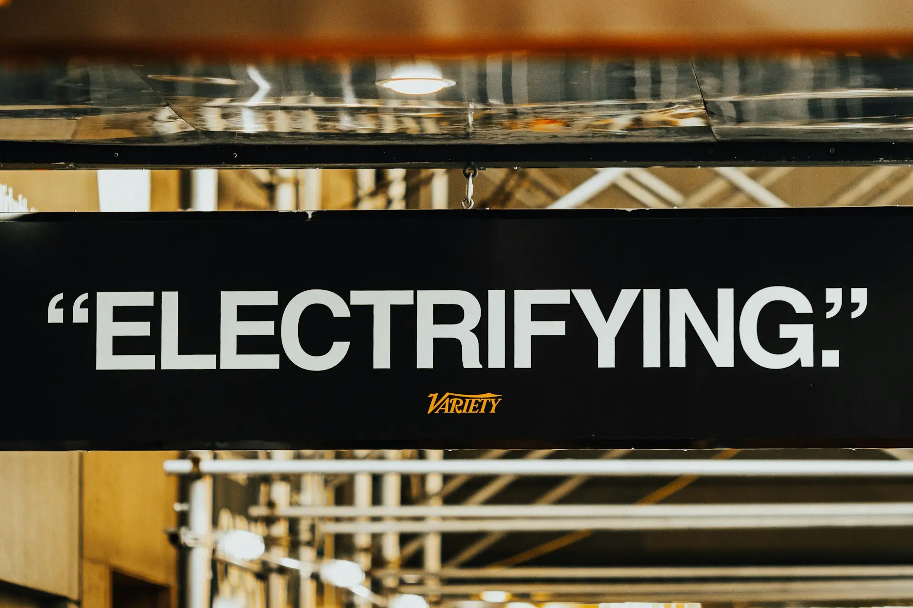

import Table from '@/components/Table'

export const columnsTarifas = [
  {
    accessorKey: "tarifa",
    header: "Tipo de Tarifa",
  },
  {
    accessorKey: "caracteristica",
    header: "Característica Principal",
  },
  {
    accessorKey: "perfilUsuario",
    header: "Perfil de Usuario Ideal",
  },
  {
    accessorKey: "ahorroEstimado",
    header: "Ahorro Potencial",
  },
];

export const dataTarifas = [
  {
    tarifa: "PVPC (Precio Voluntario Pequeño Consumidor)",
    caracteristica: "Precio variable por horas",
    perfilUsuario: "Consumo flexible, puede usar electrodomésticos en valle",
    ahorroEstimado: "Hasta 30%",
  },
  {
    tarifa: "Tarifa Plana",
    caracteristica: "Precio fijo kWh sin franjas",
    perfilUsuario: "Consumo alto constante sin flexibilidad horaria",
    ahorroEstimado: "10-15%",
  },
  {
    tarifa: "Discriminación Horaria 2.0TD",
    caracteristica: "2 o 3 periodos (punta, llano, valle)",
    perfilUsuario: "Trabaja fuera, consume principalmente noche y fines de semana",
    ahorroEstimado: "20-40%",
  },
  {
    tarifa: "Tarifa Indexada",
    caracteristica: "Precio ligado al mercado con descuento fijo",
    perfilUsuario: "Usuario avanzado que sigue el mercado eléctrico",
    ahorroEstimado: "15-25%",
  },
];

export const columnsHorarios = [
  {
    accessorKey: "periodo",
    header: "Periodo",
  },
  {
    accessorKey: "horario",
    header: "Horario (Lunes-Viernes)",
  },
  {
    accessorKey: "precioMedio",
    header: "Precio Medio kWh",
  },
  {
    accessorKey: "electrodomesticos",
    header: "Electrodomésticos Recomendados",
  },
];

export const dataHorarios = [
  {
    periodo: "Punta (P1)",
    horario: "10:00-14:00 / 18:00-22:00",
    precioMedio: "0,18-0,25 €",
    electrodomesticos: "Solo los imprescindibles",
  },
  {
    periodo: "Llano (P2)",
    horario: "8:00-10:00 / 14:00-18:00 / 22:00-00:00",
    precioMedio: "0,12-0,16 €",
    electrodomesticos: "Plancha, aspiradora, pequeños electrodomésticos",
  },
  {
    periodo: "Valle (P3)",
    horario: "00:00-08:00 + Fines de semana completos",
    precioMedio: "0,08-0,12 €",
    electrodomesticos: "Lavadora, lavavajillas, termo, coche eléctrico",
  },
];

export const columnsComparativa = [
  {
    accessorKey: "perfil",
    header: "Perfil de Consumo",
  },
  {
    accessorKey: "consumoMensual",
    header: "Consumo Mensual",
  },
  {
    accessorKey: "tarifaNormal",
    header: "Tarifa Plana (€/mes)",
  },
  {
    accessorKey: "pvpc",
    header: "PVPC Optimizado (€/mes)",
  },
  {
    accessorKey: "ahorro",
    header: "Ahorro Mensual",
  },
];

export const dataComparativa = [
  {
    perfil: "Pareja trabajadora",
    consumoMensual: "250 kWh",
    tarifaNormal: "95,00 €",
    pvpc: "68,50 €",
    ahorro: "26,50 €",
  },
  {
    perfil: "Familia 4 personas",
    consumoMensual: "400 kWh",
    tarifaNormal: "152,00 €",
    pvpc: "108,00 €",
    ahorro: "44,00 €",
  },
  {
    perfil: "Teletrabajo + familia",
    consumoMensual: "500 kWh",
    tarifaNormal: "190,00 €",
    pvpc: "145,00 €",
    ahorro: "45,00 €",
  },
  {
    perfil: "Vivienda vacacional",
    consumoMensual: "150 kWh",
    tarifaNormal: "57,00 €",
    pvpc: "48,00 €",
    ahorro: "9,00 €",
  },
];

¿Pagas de más en tu factura de la luz sin saberlo?  
**El 67% de los españoles tiene una tarifa que no se ajusta a su perfil de consumo.**

En **CalculaTuLuz.es** hemos analizado miles de casos y descubierto que elegir correctamente tu tarifa puede suponer un **ahorro de hasta 500€ al año** sin cambiar tus hábitos.

Esta guía te enseñará a optimizar tu factura según tu tipo de tarifa con estrategias prácticas y ejemplos reales 💡.

## ¿Por qué tu tarifa determina cuánto pagas realmente?

La tarifa eléctrica es el **factor más importante** en tu factura, incluso más que el consumo.

**Datos que debes conocer:**
- El precio del kWh puede variar hasta **300% entre horas punta y valle**
- Una familia media puede ahorrar **40€/mes** solo optimizando horarios
- El 82% de usuarios con PVPC no aprovecha las horas baratas

**La clave:** No se trata solo de consumir menos, sino de consumir **en el momento adecuado con la tarifa correcta**.

## Tipos de tarifas eléctricas en España (2026)

Antes de optimizar, necesitas entender qué tarifa tienes:

### 1. PVPC - Precio Voluntario Pequeño Consumidor

**Cómo funciona:**
- Precio cambia **cada hora** según el mercado mayorista
- Solo disponible para potencias ≤10 kW
- Gestión por comercializadora de referencia

**Ventajas:**
- Sin permanencia ni penalizaciones
- Precio transparente (siguiendo el mercado)
- Mayor ahorro si optimizas horarios

**Inconvenientes:**
- Requiere planificación y adaptación
- Incertidumbre en el precio mensual

### 2. Tarifa con Discriminación Horaria (2.0TD)

**Cómo funciona:**
- **3 periodos fijos:** Punta (caro), Llano (medio), Valle (barato)
- Horarios establecidos y predecibles
- Precio fijo dentro de cada periodo

**Ventajas:**
- Previsibilidad total de costes
- **Valle incluye todo el fin de semana completo**
- Ideal para trabajadores fuera de casa

**Inconvenientes:**
- Precio fijo en cada franja (no sigues el mercado)
- Horario punta muy penalizador

### 3. Tarifa Plana o Fija

**Cómo funciona:**
- Mismo precio todas las horas del día
- Sin discriminación horaria

**Ventajas:**
- Máxima simplicidad
- Sin preocupación por horarios
- Ideal para consumo distribuido uniformemente

**Inconvenientes:**
- Precio medio-alto del kWh (0,15-0,18 €)
- Pierdes oportunidad de ahorrar en valle

### 4. Tarifa Indexada

**Cómo funciona:**
- Precio ligado al mercado con descuento fijo (ej: pool -15%)
- Comercializadora aplica margen fijo sobre precio mayorista

**Ventajas:**
- Aprovechas bajadas del mercado
- Transparencia en el margen

**Inconvenientes:**
- Exposición a subidas del mercado
- Requiere seguimiento activo

## Tabla comparativa: ¿Qué tarifa te conviene?

<Table columns={columnsTarifas} data={dataTarifas} />

## Horarios y precios: Tu mapa del ahorro (Tarifa 2.0TD)

<Table columns={columnsHorarios} data={dataHorarios} />

**Nota importante:** Los fines de semana (sábado y domingo) completos son periodo valle las 24 horas.

## Estrategias de ahorro según tu tarifa

### Si tienes PVPC: Maximiza el ahorro dinámico

**Acción 1: Consulta el precio diario**
Usa apps como PVPC o consulta **[nuestra calculadora de precio de la luz](https://calculatuluz.es/precio-luz-hoy/)** cada mañana.

**Acción 2: Programa electrodomésticos grandes**
- **[Lavadora](https://calculatuluz.es/calculadora-consumo-lavadora/)**: Lanza en horas valle (00:00-08:00)
- **[Lavavajillas](https://calculatuluz.es/calculadora-consumo-lavavajillas/)**: Programado para madrugada
- **[Termo eléctrico](https://calculatuluz.es/calculadora-consumo-termo-electrico/)**: Calienta agua de noche

**Acción 3: Evita estas horas críticas**
- 10:00-14:00 (media mañana laboral)
- 18:00-22:00 (llegada del trabajo + cena)

**Ejemplo práctico:**
Una familia que mueve su consumo principal (lavadora, lavavajillas, termo) de horario punta a valle:
- Consumo desplazado: 30 kWh/semana
- Diferencia de precio: 0,20 € (punta) vs 0,10 € (valle) = 0,10 €/kWh
- **Ahorro mensual: 12 €**
- **Ahorro anual: 144 €**

### Si tienes Discriminación Horaria 2.0TD: Aprovecha los periodos

**Regla de oro:** Concentra el 70% de tu consumo en periodo valle.

**Estrategia nocturna:**
1. **22:00-00:00** → Prepara y programa electrodomésticos
2. **00:00-08:00** → Funcionamiento automático de:
   - Lavadora
   - Lavavajillas
   - Secadora
   - Carga coche eléctrico
   - Calentamiento termo

**Estrategia de fin de semana:**
Los sábados y domingos son **TODO el día periodo valle**.

**Tareas para el fin de semana:**
- Planchado intensivo
- Uso libre de [horno](https://calculatuluz.es/calculadora-consumo-horno/) y [vitrocerámica](https://calculatuluz.es/calculadora-consumo-vitroceramica/)
- [Aire acondicionado](https://calculatuluz.es/calculadora-consumo-aire-acondicionado/) o [calefacción](https://calculatuluz.es/calculadora-consumo-radiador/) sin restricciones
- Batch cooking (cocinar para toda la semana)

**Ejemplo real - Familia de 4 personas:**
- Consumo total: 400 kWh/mes
- Distribución optimizada:
  - Valle (60%): 240 kWh × 0,10 € = 24,00 €
  - Llano (30%): 120 kWh × 0,14 € = 16,80 €
  - Punta (10%): 40 kWh × 0,22 € = 8,80 €
  - **Total energía: 49,60 €**

- Sin optimizar (distribución uniforme):
  - Consumo medio: 400 kWh × 0,15 € = 60,00 €
  - **Ahorro mensual: 10,40 €** (125 €/año)

### Si tienes Tarifa Plana: Optimiza el consumo total

Sin diferencias horarias, tu estrategia se centra en **eficiencia pura**.

**Tácticas clave:**

**1. Elimina consumos fantasma**
- Electrodomésticos en standby: 5-10% del consumo total
- Cargadores enchufados sin usar
- Regletas con interruptor para apagar completamente

**2. Aprovecha electrodomésticos eficientes**
- [Freidora de aire](https://calculatuluz.es/calculadora-consumo-freidora-aire/) vs horno: 70% menos consumo
- [Microondas](https://calculatuluz.es/calculadora-consumo-microondas/) para calentar vs vitro: 50% menos
- [Bombillas LED](https://calculatuluz.es/calculadora-consumo-bombilla-led/): 80% menos que incandescentes

**3. Controla la temperatura**
- Calefacción: cada grado menos ahorra 7%
- Aire acondicionado: cada grado más ahorra 8%
- [Nevera](https://calculatuluz.es/calculadora-consumo-nevera/) a 5°C (no más frío innecesariamente)

**4. Usa temporizadores inteligentes**
Aunque no tengas diferencia de precio, programa para:
- Aprovechar inercia térmica (termo, calefacción)
- Evitar olvidos (plancha, radiador)
- Distribuir carga eléctrica

### Si tienes Tarifa Indexada: Sigue el mercado

**Herramienta esencial:** Apps de seguimiento del precio pool.

**Estrategia avanzada:**
1. **Días de precio bajo** (pool < 0,05 €/kWh):
   - Consume sin restricciones
   - Adelanta lavados
   - Carga térmica (termo al máximo, calefacción extra)

2. **Días de precio alto** (pool >0,15 €/kWh):
   - Modo ahorro extremo
   - Pospón consumos no esenciales
   - Usa electrodomésticos de bajo consumo

**Caso real - Usuario avanzado:**
- Marzo 2024: precio pool medio 0,08 €/kWh → consumo normal
- Agosto 2024: pico de 0,22 €/kWh → redujo consumo 40% durante 3 días
- **Resultado:** Factura similar a tarifa fija pero ahorrando 18€ en meses buenos

## Comparativa real: ¿Cuánto ahorras optimizando?

<Table columns={columnsComparativa} data={dataComparativa} />

**Conclusión de la tabla:**
- El ahorro oscila entre **9€ y 45€ mensuales**
- En un año: **108€ a 540€ de diferencia**
- La optimización es más efectiva con consumos medios-altos

## Casos prácticos: De la teoría a la acción

### Caso 1: Pareja joven que trabaja fuera

**Perfil:**
- Ambos trabajan 9:00-18:00
- Llegan a casa sobre las 19:00
- Fin de semana en casa

**Situación inicial:**
- Tarifa plana
- Consumo: 280 kWh/mes
- Factura: 105 € (0,37 €/kWh promedio)

**Cambio implementado:**
Cambian a 2.0TD con discriminación horaria

**Nuevos hábitos:**
- Programan lavadora y lavavajillas antes de dormir (inician 00:30)
- Termo eléctrico calientan en madrugada (02:00-06:00)
- Tareas de limpieza y plancha los sábados
- Cocinan batch cooking domingos

**Resultado:**
- 75% consumo en valle
- Nueva factura: 72 € (33 € ahorro/mes)
- **Ahorro anual: 396 €**

### Caso 2: Familia con teletrabajo

**Perfil:**
- 4 personas, padre teletrabaja
- Consumo diurno inevitable
- Alto uso electrodomésticos

**Situación inicial:**
- PVPC sin optimizar
- Consumo: 450 kWh/mes
- Factura media: 168 €

**Cambio implementado:**
Mantienen PVPC pero optimizan horarios

**Nuevos hábitos:**
- Consultan precio luz cada mañana
- Mueven gran consumo a valles (lavadora, secadora, horno)
- [PC gaming](https://calculatuluz.es/calculadora-consumo-pc-gaming/) de los hijos solo en valle/llano
- Aire acondicionado moderado en punta (solo lo esencial)

**Resultado:**
- Reducen 30% del consumo en punta
- Nueva factura media: 135 €
- **Ahorro anual: 396 €**

### Caso 3: Jubilados en casa todo el día

**Perfil:**
- Presencia continua en vivienda
- Flexibilidad total de horarios
- Uso moderado electrodomésticos

**Situación inicial:**
- Tarifa plana
- Consumo distribuido todo el día
- Factura: 95 €/mes

**Cambio implementado:**
Cambian a PVPC y reorganizan rutinas

**Nuevos hábitos:**
- Comida principal al mediodía (evitan horno en punta)
- Lavadoras 3 veces/semana en valle
- Calefacción programada en llano y valle
- Actividades sin consumo eléctrico en punta (lectura, paseos)

**Resultado:**
- Concentran 80% consumo en valle/llano
- Nueva factura: 68 €/mes
- **Ahorro anual: 324 €**

## Checklist: Optimiza tu tarifa en 7 pasos

**✅ Paso 1: Identifica tu tarifa actual**
- Revisa tu última factura
- Busca apartado "Tipo de tarifa contratada"
- Anota tu precio kWh actual

**✅ Paso 2: Analiza tu perfil de consumo**
- ¿Trabajas fuera o teletrabajas?
- ¿Puedes programar electrodomésticos?
- ¿Tienes flexibilidad horaria?

**✅ Paso 3: Calcula tu consumo por franjas**
Usa **[nuestra calculadora](https://calculatuluz.es/)** para estimar cuándo consumes más.

**✅ Paso 4: Simula el ahorro con otra tarifa**
- Compara tu factura actual vs otras opciones
- Considera costes de cambio (normalmente ninguno)

**✅ Paso 5: Cambia de tarifa si procede**
- Sin permanencia en la mayoría de casos
- Trámite online en 5 minutos
- Efectivo en 1-2 semanas

**✅ Paso 6: Implementa nuevos hábitos**
- Programa electrodomésticos
- Establece recordatorios horarios
- Educa a toda la familia

**✅ Paso 7: Monitoriza y ajusta**
- Revisa facturas mensualmente
- Identifica mejoras adicionales
- Mantén los hábitos eficientes

## Mitos sobre las tarifas eléctricas

**❌ Mito 1: "Cambiar de tarifa es complicado y caro"**
**✅ Realidad:** Sin costes, sin permanencia, trámite online en minutos.

**❌ Mito 2: "El PVPC siempre es más caro"**
**✅ Realidad:** Optimizado correctamente, es 20-30% más barato que tarifas fijas.

**❌ Mito 3: "No puedo usar lavadora de noche, hace ruido"**
**✅ Realidad:** Lavadoras modernas (>2018) son silenciosas. Alternativa: programa para 6:00 AM.

**❌ Mito 4: "Las tarifas de discriminación horaria son del pasado"**
**✅ Realidad:** La 2.0TD (2021) es la tarifa con mayor potencial de ahorro para familias.

**❌ Mito 5: "Necesito domótica cara para optimizar"**
**✅ Realidad:** Un simple temporizador de 5€ en cada electrodoméstico es suficiente.

## Herramientas imprescindibles para el ahorro

### Gratis:
- **[Calculadora CalculaTuLuz](https://calculatuluz.es/)** → Simula consumo de cada electrodoméstico
- **[Precio Luz Hoy](https://calculatuluz.es/precio-luz-hoy/)** → Consulta precio actual del kWh
- **Apps PVPC** → Notificaciones de horas baratas/caras

### Inversión baja (< 30€):
- **Temporizadores analógicos** (5€/unidad) → Programa cualquier electrodoméstico
- **Medidor consumo enchufable** (15€) → Conoce consumo real de cada aparato
- **Regletas con interruptor** (8€) → Elimina standby fácilmente

### Inversión media (30-150€):
- **Enchufes inteligentes WiFi** (12€/unidad) → Control remoto y programación app
- **Termostato programable** (60-120€) → Optimiza calefacción/AC automáticamente

## Preguntas frecuentes

**¿Puedo cambiar de tarifa sin cambiar de compañía?**
Sí, puedes solicitar cambio de modalidad con tu comercializadora actual sin coste.

**¿Cuánto tarda en hacerse efectivo un cambio de tarifa?**
Entre 5 y 15 días hábiles desde la solicitud.

**¿Perderé dinero si cambio y no me adapto?**
No hay penalización por cambio. Si no te adaptas, simplemente no ahorrarás, pero tampoco pagarás más.

**¿Qué pasa si salto la potencia contratada en hora punta?**
Salta el ICP (interruptor de control de potencia) y se va la luz temporalmente. Considera aumentar potencia si ocurre frecuentemente.

**¿Compensa instalar paneles solares con estas tarifas?**
Sí, la combinación de autoconsumo solar + discriminación horaria puede reducir tu factura hasta un 70%.

**¿Las comercializadoras dificultan el cambio de tarifa?**
Por ley deben facilitar el cambio. Si encuentras obstáculos, contacta con la CNMC (Comisión Nacional de Mercados y Competencia).

## Tu siguiente paso: Calcula tu ahorro real

No dejes tu factura al azar. **Con la tarifa correcta y pequeños ajustes de hábitos, puedes ahorrar entre 200€ y 500€ al año.**

**Empieza ahora:**

1. **[Accede a nuestra calculadora](https://calculatuluz.es/)** y descubre el consumo real de tus electrodomésticos
2. **[Consulta el precio de la luz hoy](https://calculatuluz.es/precio-luz-hoy/)** y planifica tu consumo
3. **[Lee nuestros tips de ahorro](https://calculatuluz.es/tipsyguias/como-ahorrar-luz/)** para más estrategias

**Recuerda:** El mejor ahorro no es consumir menos, sino **consumir de forma inteligente**.

---

**¿Has conseguido ahorrar optimizando tu tarifa?** Comparte tu experiencia en los comentarios. Tu caso puede ayudar a otros usuarios a tomar la mejor decisión 💡