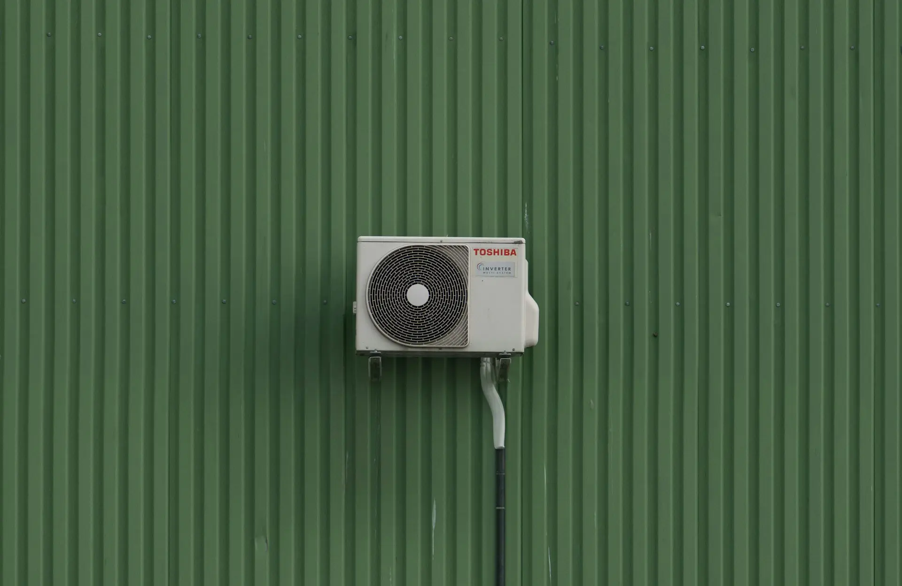

En **CalculaTuLuz.es** analizamos en profundidad cuánta energía consume realmente un aire acondicionado al funcionar durante 8 horas continuas. Descubre cómo afecta a tu factura eléctrica y qué puedes hacer para optimizar su uso.

## Consumo energético detallado por tipos de aire acondicionado

El consumo varía significativamente según la tecnología y potencia del equipo. Estos son los valores de referencia:

### Tabla comparativa de consumo (8 horas de uso)

| Tipo de equipo | Potencia (kW) | Eficiencia | Consumo por hora | Consumo 8h | Coste diario* |
|----------------|--------------|------------|------------------|------------|---------------|
| Split básico   | 2.2          | B          | 2.2 kWh          | 17.6 kWh   | 2.64 €        |
| Split inverter | 1.5          | A++        | 1.1 kWh          | 8.8 kWh    | 1.32 €        |
| Portátil       | 2.5          | C          | 2.5 kWh          | 20 kWh     | 3.00 €        |

*Calculado a 0.15€/kWh

## Factores clave que determinan el consumo real

### 1. Eficiencia energética (etiqueta ECO)
Los equipos con clasificación A+++ consumen hasta un 60% menos que los modelos convencionales.

### 2. Tecnología Inverter
- Reduce el consumo entre 25-40%
- Mantiene temperatura constante
- Menos arranques del compresor

### 3. Condiciones ambientales
- Cada grado por debajo de 24°C aumenta el consumo un 8%
- La humedad ambiental afecta el rendimiento
- La orientación de la vivienda influye en la carga térmica

## Cálculo personalizado del consumo

Para calcular exactamente cuánto consume TU aire acondicionado:

1. Identifica la potencia en kW (manual técnico o placa del equipo)
2. Multiplica por las horas de uso
3. Aplica tu tarifa eléctrica

**Fórmula:**  
`Consumo = Potencia (kW) × Horas × Precio kWh`

## Impacto económico mensual

| Escenario | Consumo diario | Coste mensual* |
|-----------|----------------|----------------|
| Uso moderado (4h/día) | 6 kWh | 27 € |
| Uso intensivo (8h/día) | 12 kWh | 54 € |
| Uso extremo (12h/día) | 18 kWh | 81 € |

*Considerando 0.15€/kWh y 30 días

## 10 Consejos para reducir el consumo

1. Mantén la temperatura entre 24-26°C
2. Usa el modo "ECO" o "Smart"
3. Programa el temporizador para uso nocturno
4. Limpia los filtros cada 2 meses
5. Complementa con ventiladores de techo
6. Mejora el aislamiento de ventanas
7. Cierra persianas en horas de sol
8. Realiza mantenimiento anual profesional
9. Considera sistemas zonificados
10. Aprovecha la ventilación natural cuando sea posible

## Preguntas frecuentes

### ¿Cuánto consume un aire de 12.000 BTU?
Un equipo de 12.000 BTU (3.5 kW) consume aproximadamente 3.5 kWh por hora, lo que supone 28 kWh en 8 horas (unos 4.20€ diarios).

### ¿Es mejor apagarlo y encenderlo o dejarlo encendido?
Los equipos inverter consumen menos manteniendo temperatura constante. Para usos superiores a 4 horas, es más eficiente no apagarlo completamente.

### ¿Cómo afecta la humedad al consumo?
En zonas húmedas, el equipo trabaja más para deshumidificar, aumentando el consumo hasta un 15-20%.

## Conclusión final

El consumo de un aire acondicionado en 8 horas puede variar entre 8 kWh (equipos eficientes) y 20 kWh (modelos antiguos), con un coste asociado de 1.20€ a 3.00€ diarios. La elección de un equipo eficiente, combinado con buenos hábitos de uso, puede reducir tu factura eléctrica en verano hasta un 40%.

¿Quieres saber exactamente cuánto consume tu equipo? [Calcula tu consumo personalizado aquí](https://calculatuluz.es)