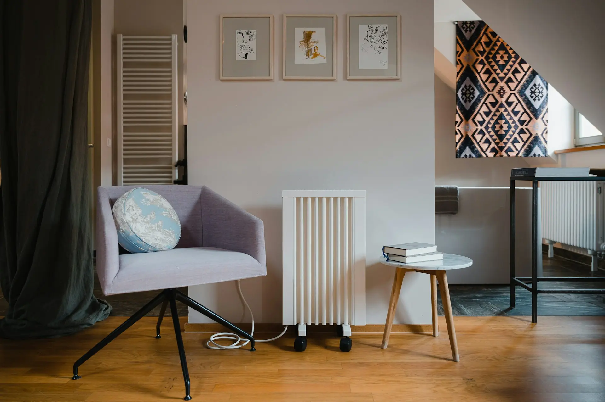

import Table from '@/components/Table'
import ProductComparisonTable from '@/components/ProductComparisonTable'
import ProsConsCard from '@/components/ProsConsCard'
import { TrendingUp, Zap, ThermometerSun, DollarSign, Clock, AlertCircle } from 'lucide-react'

export const consumoColumns = [
  {
    accessorKey: "modelo",
    header: "Modelo",
  },
  {
    accessorKey: "potencia",
    header: "Potencia",
  },
  {
    accessorKey: "coste_hora",
    header: "Coste/hora",
  },
  {
    accessorKey: "coste_mes",
    header: "Coste mensual*",
  },
  {
    accessorKey: "valoracion",
    header: "Valoración",
  },
];

export const consumoData = [
  {
    modelo: "Xiaomi Smartmi 1S",
    potencia: "2200W",
    coste_hora: "0,84€",
    coste_mes: "50,40€",
    valoracion: "⭐⭐⭐⭐⭐",
  },
  {
    modelo: "Orbegozo RRE 1310",
    potencia: "1300W",
    coste_hora: "0,49€",
    coste_mes: "29,40€",
    valoracion: "⭐⭐⭐⭐",
  },
  {
    modelo: "De'Longhi Dragon 4",
    potencia: "1500W",
    coste_hora: "0,57€",
    coste_mes: "34,20€",
    valoracion: "⭐⭐⭐⭐⭐",
  },
  {
    modelo: "Cecotec Ready Warm",
    potencia: "1500W",
    coste_hora: "0,57€",
    coste_mes: "34,20€",
    valoracion: "⭐⭐⭐⭐",
  },
  {
    modelo: "Rowenta SO9420",
    potencia: "2400W",
    coste_hora: "0,91€",
    coste_mes: "54,60€",
    valoracion: "⭐⭐⭐⭐",
  },
];

export const productData = [
  {
    id: 1,
    nombre: "Xiaomi Smartmi 1S",
    potencia: 2200,
    consumo_mes: "50,40€",
    precio: "100-120€",
    eficiencia: "A++",
    caracteristicas: ["WiFi", "App Control", "Termostato Digital", "Calentamiento 3s"],
    pros: ["Control inteligente por app", "Termostato preciso ±0,1°C", "Diseño compacto", "Seguridad IPX4"],
    contras: ["Requiere WiFi", "Precio superior", "App en inglés"],
    mejor_para: "Usuarios tech que valoran control remoto",
    puntuacion: 4.8
  },
  {
    id: 2,
    nombre: "Orbegozo RRE 1310",
    potencia: 1300,
    consumo_mes: "29,40€",
    precio: "80-95€",
    eficiencia: "A+",
    caracteristicas: ["13 Elementos", "3 Niveles", "Muy Silencioso", "Termostato Ajustable"],
    pros: ["El de menor consumo", "Muy silencioso", "Ideal habitaciones pequeñas", "Precio competitivo"],
    contras: ["Tarda en calentar espacios grandes", "Sin WiFi", "Diseño básico"],
    mejor_para: "Ahorro máximo en dormitorios",
    puntuacion: 4.5
  },
  {
    id: 3,
    nombre: "De'Longhi Dragon 4",
    potencia: 1500,
    consumo_mes: "34,20€",
    precio: "110-130€",
    eficiencia: "A++",
    caracteristicas: ["Aceite Dieléctrico", "Real Energy", "10 Años Garantía", "Ruedas"],
    pros: ["Calidad premium italiana", "Mantiene calor 30min", "Real Energy -25%", "Garantía 10 años"],
    contras: ["Peso 10kg", "Tarda 10-15min", "Sin WiFi"],
    mejor_para: "Máxima durabilidad y calidad",
    puntuacion: 4.9
  },
  {
    id: 4,
    nombre: "Cecotec Ready Warm",
    potencia: 1500,
    consumo_mes: "34,20€",
    precio: "70-85€",
    eficiencia: "A",
    caracteristicas: ["Panel Táctil", "Mando Distancia", "9 Elementos", "IP24"],
    pros: ["Mejor relación calidad-precio", "Panel táctil moderno", "Mando incluido", "Programable 24h"],
    contras: ["Calidad inferior a De'Longhi", "Sin app", "Ruidos tras meses"],
    mejor_para: "Presupuesto ajustado con funciones",
    puntuacion: 4.3
  },
  {
    id: 5,
    nombre: "Rowenta SO9420",
    potencia: 2400,
    consumo_mes: "54,60€",
    precio: "90-110€",
    eficiencia: "A",
    caracteristicas: ["Instant Heat", "49dB Silence", "Filtro Aire", "Termostato Electrónico"],
    pros: ["Calentamiento instantáneo", "Muy silencioso 49dB", "Para espacios grandes", "Filtro aire integrado"],
    contras: ["Mayor consumo de todos", "Diseño voluminoso", "Precio elevado"],
    mejor_para: "Espacios grandes, uso puntual",
    puntuacion: 4.4
  }
];

El precio de la luz en España ha vuelto a subir este invierno 2025-2026, alcanzando picos de **0,40 €/kWh** en las horas más caras. Si usas un calefactor antiguo de 2000W durante 8 horas al día, **estás pagando más de 240€ al mes solo en calefacción**.

La buena noticia: **no todos los calefactores son igual de costosos**. Hemos analizado el mercado y calculado el consumo real en euros de los modelos más vendidos en Amazon España para ayudarte a elegir el que menos te costará este invierno.

  <AlertCircle size={20} />
  
<strong>Antes de comprar:</strong> Usa nuestra <a href="/calculadora-consumo-calefactor/">calculadora de consumo de calefacción</a> para saber cuánto gastas actualmente y compáralo con estas opciones.

## Qué hemos analizado (Metodología)

Para esta comparativa hemos evaluado:

  

    <Zap size={24} />
    

      <strong>Consumo real en kWh y euros</strong>
      Precio medio 0,38 €/kWh
    

  

  

    <TrendingUp size={24} />
    

      <strong>Eficiencia energética </strong>
      Certificación EU
    

  

  

    <Zap size={24} />
    

      <strong>Valoraciones reales</strong>
      Mínimo 500 opiniones Amazon
    

  

  

    <DollarSign size={24} />
    

      <strong>Relación calidad-precio</strong>
      Análisis coste-beneficio
    

  

**Importante:** Todos los cálculos incluyen el **factor de uso real con termostato** (los calefactores no están al 100% todo el tiempo). Esto reduce el consumo efectivo entre un 40-60% según el modelo.

## Tabla comparativa: Consumo y coste mensual

<Table columns={consumoColumns} data={consumoData} />

*Cálculo basado en 2 horas/día de uso efectivo (con termostato), precio medio 0,38 €/kWh

## Comparativa detallada de productos

<ProductComparisonTable data={productData} client:load />

## Los 5 Mejores Calefactores de Bajo Consumo 2026

### 1. Xiaomi Smartmi 1S - El Inteligente que se Paga Solo

  

**Potencia:** 2200W (regulable)  
**Consumo efectivo:** 6 kWh/día (2h uso)  
**Coste mensual:** 50,40€  
**Precio aproximado:** 100-120€

#### Por qué destaca
El Xiaomi Smartmi no es técnicamente el de menor potencia, pero es el **más eficiente en la práctica** gracias a su control por app y termostato inteligente que aprende de tus hábitos.

<ProsConsCard 
  pros={[
    "Control por app (Mi Home): programas horarios exactos desde el móvil",
    "Termostato digital preciso (±0,1°C)",
    "Calentamiento rápido en 3 segundos",
    "Diseño compacto y seguro (certificación IPX4)",
    "Doble sistema de seguridad anti-vuelco"
  ]}
  cons={[
    "Requiere WiFi para funciones inteligentes",
    "Precio superior a la media",
    "App en inglés (aunque intuitiva)"
  ]}
  savings="15-20€/mes vs calefactor convencional"
  client:load
/>

  
<strong>¿Cuánto gastarías con este modelo en tu casa?</strong>

  <a href="https://www.amazon.es/s?k=xiaomi+smartmi+calefactor" target="_blank" rel="nofollow noopener" class="btn-amazon">Ver Precio Actual en Amazon</a>

---

### 2. Orbegozo RRE 1310 - El Rey del Ahorro

  

**Potencia:** 1300W  
**Consumo efectivo:** 3.9 kWh/día (2h uso)  
**Coste mensual:** 29,40€  
**Precio aproximado:** 80-95€

#### Por qué destaca
Si buscas **consumir lo mínimo**, este es tu calefactor. Con solo 1300W es el de menor potencia de la lista, ideal para dormitorios de hasta 15m².

<ProsConsCard 
  pros={[
    "El que menos consume de todos (casi la mitad que modelos de 2400W)",
    "13 elementos de calor para mejor distribución",
    "Termostato ajustable",
    "Muy silencioso (ideal para dormir)",
    "3 niveles de potencia (800W, 1300W, programable)"
  ]}
  cons={[
    "Tarda más en calentar espacios grandes",
    "Sin control WiFi",
    "Diseño básico (funcional, no premium)"
  ]}
  savings="25-30€/mes vs calefactor convencional"
  client:load
/>

  
<strong>Perfecto para habitaciones pequeñas y ahorrar al máximo</strong>

  <a href="https://www.amazon.es/s?k=orbegozo+rre+1310" target="_blank" rel="nofollow noopener" class="btn-amazon">Ver Precio Actual en Amazon</a>

---

### 3. De'Longhi Dragon 4 TRD41025B - El Equilibrio Perfecto

  

**Potencia:** 1500W  
**Consumo efectivo:** 4.5 kWh/día (2h uso)  
**Coste mensual:** 34,20€  
**Precio aproximado:** 110-130€

#### Por qué destaca
La marca italiana De'Longhi lleva 40 años fabricando radiadores de aceite. Este modelo es el **equilibrio perfecto entre eficiencia, calidad y precio**.

<ProsConsCard 
  pros={[
    "Tecnología de aceite dieléctrico (mantiene calor 30 min después de apagado)",
    "Sistema \"Real Energy\" que reduce consumo un 25%",
    "Termostato de ambiente regulable",
    "Asa térmica y ruedas para moverlo fácilmente",
    "10 años de garantía del fabricante"
  ]}
  cons={[
    "Peso elevado (10kg) por el aceite",
    "Tarda 10-15 min en alcanzar temperatura óptima",
    "No tiene WiFi"
  ]}
  savings="20€/mes vs calefactor convencional"
  client:load
/>

  
<strong>La opción más fiable y duradera</strong>

  <a href="https://www.amazon.es/s?k=delonghi+dragon+4+radiador" target="_blank" rel="nofollow noopener" class="btn-amazon">Ver Precio Actual en Amazon</a>

---

### 4. Cecotec Ready Warm 9000 Touch - El Mejor Relación Calidad-Precio

  

**Potencia:** 1500W  
**Consumo efectivo:** 4.5 kWh/día (2h uso)  
**Coste mensual:** 34,20€  
**Precio aproximado:** 70-85€

#### Por qué destaca
Cecotec ha creado un calefactor con características premium a **precio de entrada**. Si tu presupuesto es ajustado, esta es tu mejor opción.

<ProsConsCard 
  pros={[
    "Panel táctil digital (muy moderno)",
    "Programable 24h con temporizador",
    "Mando a distancia incluido",
    "9 elementos para distribución uniforme",
    "Protección IP24 (resistente a salpicaduras)"
  ]}
  cons={[
    "Calidad de construcción inferior a De'Longhi",
    "Sin app móvil",
    "Algunos usuarios reportan ruidos tras meses de uso"
  ]}
  savings="20€/mes vs calefactor convencional"
  client:load
/>

  
<strong>Funciones premium sin arruinarte</strong>

  <a href="https://www.amazon.es/s?k=cecotec+ready+warm+9000" target="_blank" rel="nofollow noopener" class="btn-amazon">Ver Precio Actual en Amazon</a>

---

### 5. Rowenta SO9420 Intense Comfort Hot - El Potente

  

**Potencia:** 2400W  
**Consumo efectivo:** 7.2 kWh/día (2h uso)  
**Coste mensual:** 54,60€  
**Precio aproximado:** 90-110€

#### Por qué destaca
¿Necesitas calentar un salón de 30m² en 5 minutos? Este es tu calefactor. Es el **más potente de la lista**, pero también el que más consume.

<ProsConsCard 
  pros={[
    "Calentamiento ultrarrápido (tecnología Instant Heat)",
    "Ventilador silencioso (49dB)",
    "Termostato electrónico preciso",
    "Función \"Silence\" para uso nocturno",
    "Filtro de aire integrado"
  ]}
  cons={[
    "Mayor consumo de todos (ideal si lo usas poco tiempo)",
    "Diseño voluminoso",
    "Precio elevado para su tecnología"
  ]}
  client:load
/>

  <AlertCircle size={20} color="#9a3412" />
  
<strong>Consumo estimado:</strong> Solo recomendado si necesitas calentar rápido y por poco tiempo

  
<strong>Para espacios grandes que necesitan calor YA</strong>

  <a href="https://www.amazon.es/s?k=rowenta+so9420+calefactor" target="_blank" rel="nofollow noopener" class="btn-amazon">Ver Precio Actual en Amazon</a>

## Calcula TU consumo con estos modelos

¿Quieres saber cuánto te costaría cada uno en TU casa según TUS horas de uso?

Usa nuestra [Calculadora de Consumo Eléctrico](https://calculatuluz.es/) y compara:
1. Introduce la potencia del modelo (ej: 1500W)
2. Tus horas de uso reales (ej: 6h/día)
3. Obtén el coste exacto en €/mes

También puedes calcular otros electrodomésticos:
- [Aire acondicionado](https://calculatuluz.es/calculadora-consumo-aire-acondicionado/)
- [Termo eléctrico](https://calculatuluz.es/calculadora-consumo-termo-electrico/)
- [Horno](https://calculatuluz.es/calculadora-consumo-horno/)

## Guía de compra: Cómo elegir tu calefactor según tu situación

### Para habitaciones pequeñas (10-15m²)
**Recomendado:** Orbegozo RRE 1310 (1300W)  
**Por qué:** Suficiente potencia, mínimo consumo, ideal para dormitorios.

### Para salones medianos (20-25m²)
**Recomendado:** De'Longhi Dragon 4 (1500W) o Cecotec Ready Warm  
**Por qué:** Buen equilibrio entre cobertura y eficiencia.

### Si valoras la tecnología
**Recomendado:** Xiaomi Smartmi 1S  
**Por qué:** Control por app, programación inteligente, diseño premium.

### Si buscas el máximo ahorro
**Recomendado:** Orbegozo RRE 1310  
**Por qué:** El de menor consumo absoluto (29€/mes vs 50€).

### Para espacios grandes o uso puntual
**Recomendado:** Rowenta SO9420  
**Por qué:** Calentamiento instantáneo, úsalo 30min y apaga.

## 5 Consejos para reducir el consumo de tu calefactor

Independientemente del modelo que elijas, estos trucos te ahorrarán dinero:

  

    <Clock size={32} />
    <h4>Programa en horas valle</h4>
    
Si tienes <a href="/precio-luz-hoy/">tarifa discriminación horaria</a>, enciende el calefactor de 00:00 a 08:00 (luz más barata).

  

  

    <ThermometerSun size={32} />
    <h4>Temperatura óptima</h4>
    
No superes los 21°C. Cada grado extra aumenta el consumo un 7%.

  

  

    <Zap size={32} />
    <h4>Cierra puertas</h4>
    
Aisla la habitación que calientas. El calor escapado es dinero perdido.

  

  

    <Clock size={32} />
    <h4>Usa temporizadores</h4>
    
Apaga 30min antes de salir de casa (el calor residual se mantiene).

  

  <strong>Dato importante:</strong> Aplicando estos 5 consejos puedes reducir tu factura de calefacción hasta un 30% adicional.

## Preguntas frecuentes

**¿Cuál es el calefactor que menos gasta de luz en 2026?**  
El Orbegozo RRE 1310 con 1300W es el de menor consumo: solo 29,40€/mes frente a los 50-55€ de modelos más potentes.

**¿Merece la pena pagar más por un calefactor inteligente?**  
Sí, si lo usas más de 4 horas al día. El Xiaomi Smartmi se paga solo en 3-4 meses gracias a su gestión eficiente del consumo.

**¿Radiador de aceite o convector?**  
Para uso continuado (más de 2h), los radiadores de aceite (De'Longhi, Orbegozo) son más eficientes. Para calentar rápido y apagar, los convectores (Rowenta).

**¿Cuánto tarda en notarse el ahorro?**  
Desde el primer mes. Si cambias un calefactor de 2000W sin termostato por un Orbegozo de 1300W, ahorras aproximadamente 25€/mes.

**¿Necesito cambiar mi potencia contratada?**  
Si usas varios calefactores simultáneamente, calcula: potencia contratada debe ser mayor que la suma de potencias. [Calcula aquí tu consumo total](https://calculatuluz.es/mi-consumo/).

## Conclusión: ¿Cuál comprar en 2026?

Después de analizar consumo, precio y prestaciones:

- **Mejor opción general:** De'Longhi Dragon 4 (durabilidad + eficiencia)
- **Máximo ahorro:** Orbegozo RRE 1310 (el que menos consume)
- **Mejor tecnología:** Xiaomi Smartmi 1S (control inteligente)
- **Mejor relación calidad-precio:** Cecotec Ready Warm 9000

**Recuerda:** El "mejor" calefactor depende de tu situación. Usa nuestra [calculadora](https://calculatuluz.es/) para simular el consumo de cada modelo con TUS hábitos reales antes de decidir.

---

**Última actualización:** Diciembre 2025  
**Precios consultados en:** Amazon.es  

Los enlaces a productos son búsquedas genéricas en Amazon. Los precios pueden variar según ofertas del momento.

